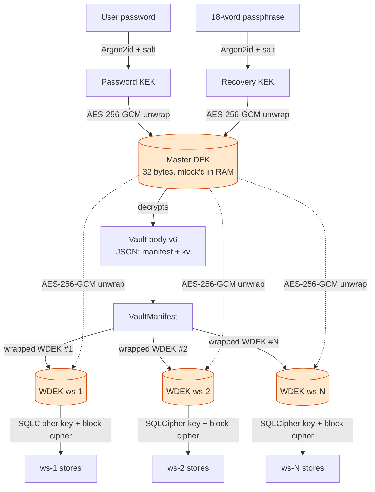
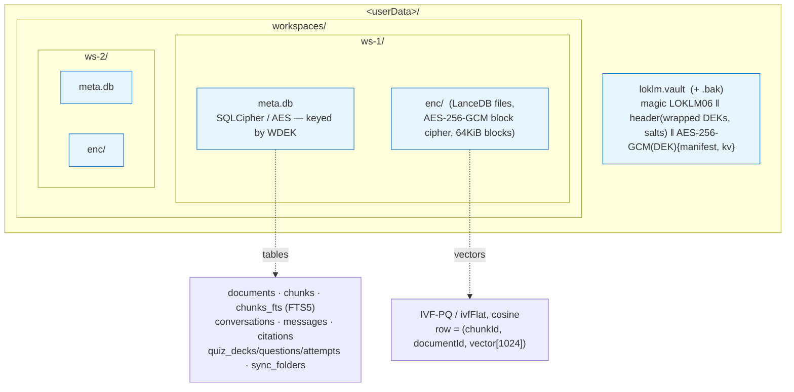
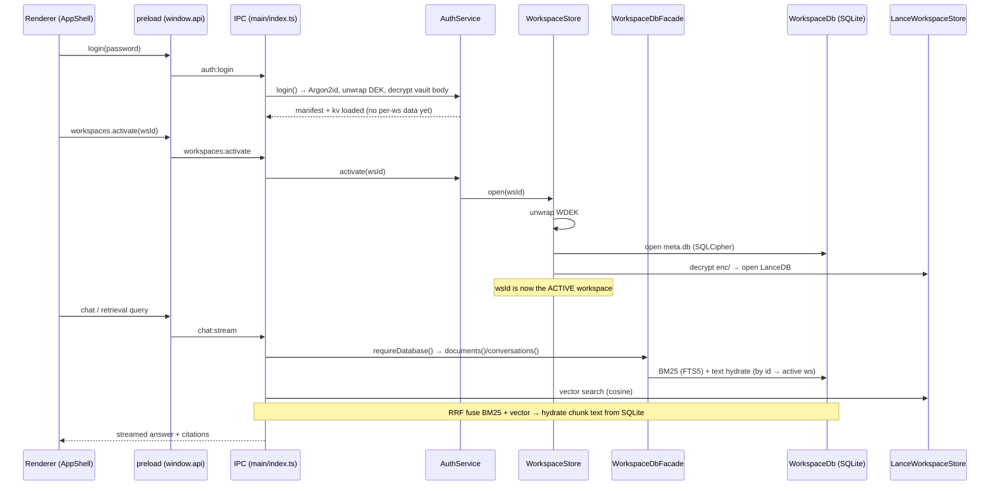
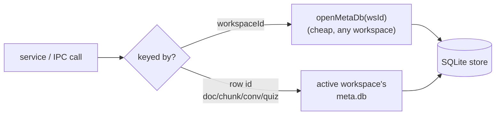
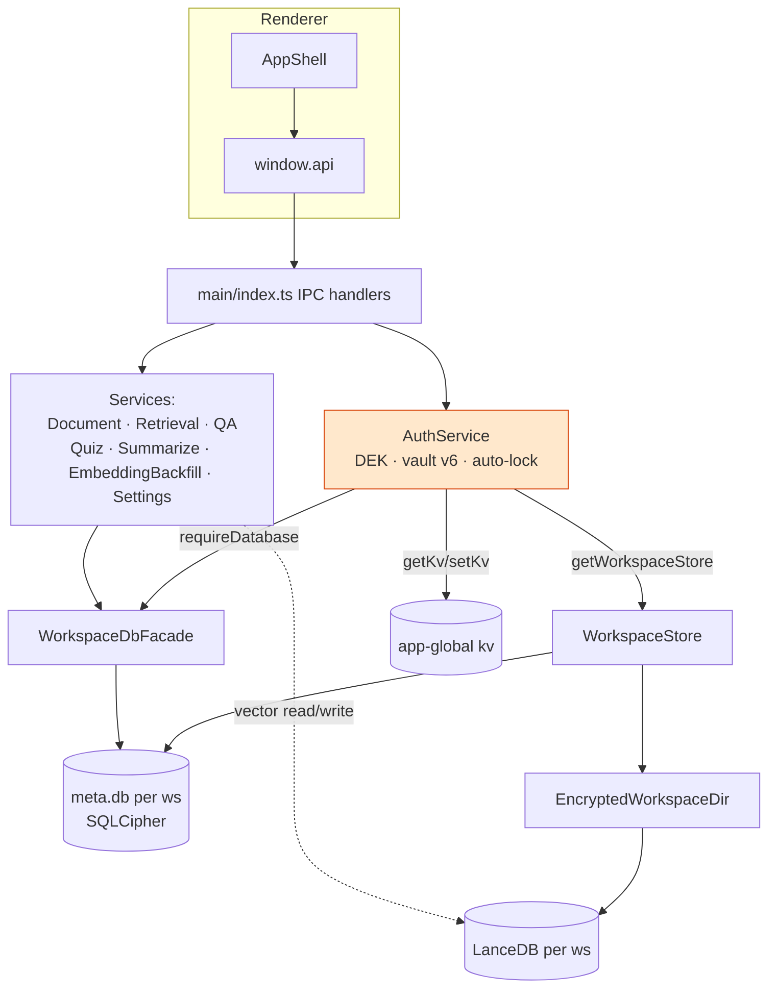

# LokLM Storage & Encryption Architecture (ADR-0005)

How data is stored, encrypted, and read after the per-workspace cutover. Three
views: the **key hierarchy**, the **on-disk layout**, and the **runtime request
flow**. All diagrams are Mermaid (render on GitHub).

---

## 1. Key hierarchy — what unlocks what

One install-lifetime **master DEK** encrypts the vault. Each workspace has its own
**WDEK** (workspace data key), wrapped under the master DEK and stored in the
vault manifest. A workspace's encrypted files can only be opened once its WDEK is
unwrapped — so loading one workspace never decrypts the others.

- The DEK never hits disk in plaintext; it lives in `mlock`'d memory only between
  unlock and lock.
- Password reset re-wraps the **same** DEK under new KEKs, so library content
  survives recovery.
- `kv` holds app-global settings + avatar (formerly the PGlite `settings` table).

---

## 2. On-disk layout — encrypted at rest

**The two stores per workspace, and why they're split:**

| Store            | Engine                            | Holds                                                            | Lifetime                                                         |
| ---------------- | --------------------------------- | ---------------------------------------------------------------- | ---------------------------------------------------------------- |
| `meta.db`        | better-sqlite3 + SQLCipher        | text, metadata, FTS5 index, chats, quizzes, **embedded markers** | cheap to open — **many** open at once (background sync)          |
| `enc/` → LanceDB | `@lancedb/lancedb` + block cipher | chunk **vectors** only                                           | expensive (decrypt-on-open) — **one** active workspace at a time |

`meta.db` is the **source of truth**: vectors are derived from chunk text and can
be re-embedded, so a lost/corrupt Lance store self-heals from SQLite.

---

## 3. Runtime request flow — unlock, switch, query

**Facade routing rule** (`WorkspaceDbFacade`):

That's why the renderer calls `workspaces.activate(id)` on every workspace
switch — id-keyed reads resolve against whichever workspace is active.

---

## 4. Component map

---

### Scale notes

- Vectors target **100–500M** at corpus scale: LanceDB uses IVF-PQ with a config
  sized by `suggestIndexConfig(dims, rowCount)`; small workspaces stay on
  `ivfFlat`. RAM tracks the **single active** workspace, not the whole corpus.
- BGE-M3, 1024-dim, cosine (`_distance = 1 − cosine`).
