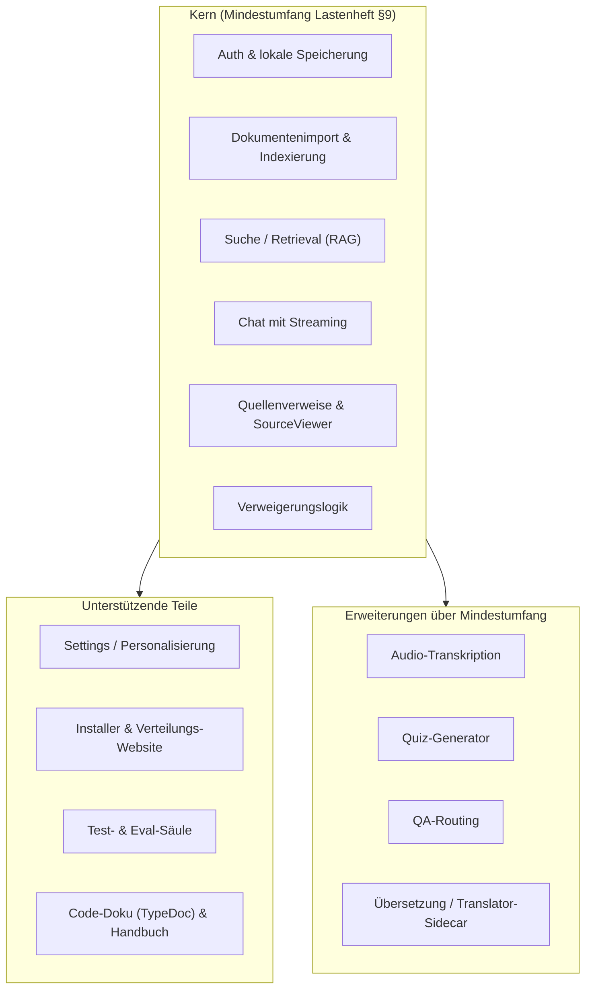

# Projektumfang und Abgrenzung

## 6.1 Was das Projekt umfasst

LokLM umfasst eine **vollständige, lokal lauffähige Desktop-Anwendung** mit den folgenden funktionalen Säulen (Lastenheft §5, Pflichtenheft §3; Tabelle 6.1):

**Tabelle 6.1:** Funktionale Säulen von LokLM.

| Säule                       | Inhalt                                                                                                |
| --------------------------- | ---------------------------------------------------------------------------------------------------- |
| **Anmeldung & Sicherheit**  | Registrierung, Login/Logout, Passwort-Wiederherstellung über lokale Recovery-Codes, argon2id-Hashing, Inaktivitäts-Sperre, verschlüsselte lokale Persistenz |
| **Dokumentenverwaltung**    | Import von PDF, Markdown, Text, Quellcode, optional DOCX; Arbeitsbereiche (Workspaces); CRUD; Hintergrund-Indexierung mit Fortschrittsanzeige |
| **Suche & Retrieval**       | bilinguale Volltextsuche (`tsvector` DE/EN) + semantische Vektorsuche (`pgvector`/HNSW); RRF-Fusion; Cross-Encoder-Reranking (in höheren Tiers); Suche/Filter im Workspace |
| **Chat & Antwort**          | Chat-Oberfläche mit gestreamten Antworten; Promptaufbau aus abgerufenen Chunks; Verweigerungslogik |
| **Quellenverifikation**     | klickbare Citations `[doc:<id>, chunk:<id>]`; SourceViewer mit Originalpassage und Kontext         |
| **Personalisierung**        | Einstellungen (Chunkgröße/Überlappung/Top-K, Modell-Profil, Theme, Sprache, Account-Bereich)        |
| **Auslieferung**            | Windows-Installer (NSIS) + Linux-AppImage; Verteilungs-Website; First-Launch-Modell-Download         |
| **Test & Evaluierung**      | Unit-, Integrations- und Eval-Tests; Eval-Dev-Set + Hold-out + RAG-Matrix-Harness                    |

Zusätzlich wurden über den ursprünglichen Mindestumfang hinaus weitere Features integriert (siehe 6.5).

## 6.2 Was das Projekt nicht umfasst

Nicht Bestandteil (vollständige Liste in Kapitel 05 und Pflichtenheft §1.3): Cloud-Sync, Antworten aus Internetwissen, Mehrbenutzerbetrieb, mobile/Browser-Versionen, OCR, externe/gemeinsame Datenbanken, Zwei-Faktor-Authentifizierung, automatisches Modell-Auto-Update und kostenpflichtige Funktionen. Diese Abgrenzungen folgen direkt aus dem Lokalitäts- und Datenschutzprinzip oder dem schulischen Zeitrahmen.

Die optionalen **Kann-Erweiterungen** — lokales Feintuning (QLoRA), code-bewusste Aufteilung, automatische Zusammenfassungen — sind **keine Zusicherung** und nur nach Erreichen eines stabilen Mindestumfangs vorgesehen (Go/No-Go-Gate G3, Pflichtenheft §9.4).

## 6.3 Kern- und unterstützende Teile

Abbildung 6.1 ordnet die Bestandteile in Kern, unterstützende Teile und Erweiterungen.

**Abbildung 6.1:** Gliederung in Kern (Mindestumfang), unterstützende Teile und Scope-Erweiterungen.

## 6.4 Partner- und Teilbereiche (Schnittstellen)

Die Arbeit ist klar zwischen den beiden Teammitgliedern aufgeteilt (Detailtabelle in Kapitel 07). Die wichtigste interne Schnittstelle ist die **IPC-Grenze** zwischen Renderer (React-UI) und Hauptprozess (Node-Services) über `window.api`/contextBridge (Tabelle 6.2):

**Tabelle 6.2:** Verantwortungsbereiche und ihre wechselseitigen Schnittstellen.

| Bereich (Owner)                          | Schnittstelle zum jeweils anderen Bereich                                    |
| ---------------------------------------- | ---------------------------------------------------------------------------- |
| **Backend/RAG/Auth (Denys Tudosa)**      | stellt Services + IPC-Kanäle bereit (`AuthService`, `DocumentService`, `RetrievalService`, `EmbeddingService`, `LlamaService`, `ChunkerService`, `ParserService`) |
| **UI/Tests/Doku (Dominik Furlan)**       | konsumiert IPC in der UI (Suche AP-6, Settings AP-9, Auth-UI AP-2.2), testet die Services (AP-T.1/T.2), erstellt Eval-Set + Doku |

Die Test- und Eval-Säule bildet eine **Verifikations-Schnittstelle** über beide Bereiche: Sie prüft die von Denys gebauten Services (Retrieval, Chunking, Auth) gegen reale Datenbestände und misst die Antwortqualität.

## 6.5 Scope-Erweiterungen über den Mindestumfang

Im Projektverlauf wurden Funktionen integriert, die über den ursprünglichen Lastenheft-Mindestumfang hinausgehen (Tabelle 6.3):

**Tabelle 6.3:** Scope-Erweiterungen über den Mindestumfang.

| Erweiterung               | Release | Bezug                                          |
| ------------------------- | ------- | ---------------------------------------------- |
| Audio-Transkription (Whisper + Sprecher-Diarisation) | v0.4.0 | über NZ-6 hinaus; bewusste Erweiterung |
| Quiz-Generator (chunk-getrieben) | v0.4.0/Rework | Lernunterstützung                      |
| QA-Routing (doc-summary/Korpus + Decomposition) | v0.4.1 | ADR-0003                              |
| Übersetzung + Windows-GPU-Translator-Sidecar | v0.4.1 | plattformübergreifend                  |
| Linux-AppImage            | ab v0.2.x | Nachtrag v1.1.1 (NZ-8 angepasst)            |

Transkription (NZ-6) und Quiz waren ursprünglich nicht im Mindestumfang. Audio-Transkription und Quiz sind eine **bewusste Scope-Erweiterung über den Mindestumfang** und kein zugesicherter v1-Mindest-Liefergegenstand; das Lastenheft (§10) grenzt Transkription ausdrücklich ab.

## 6.6 Plattform-Abgrenzung

Tabelle 6.4 grenzt die unterstützten Plattformen ab.

**Tabelle 6.4:** Plattform-Abgrenzung.

| Plattform | Status                                                                                 |
| --------- | -------------------------------------------------------------------------------------- |
| Windows 10/11 (64-bit) | Zielplattform; NSIS-Installer ausgeliefert                                 |
| Linux     | AppImage ausgeliefert (Nachtrag v1.1.1)                                                 |
| macOS     | Build-Pipeline + DMG-Build vorhanden; Payloads noch nicht publiziert → **kein zugesicherter v1-Liefergegenstand** (Nachtrag v1.1.2) |

Damit ist die Plattform-Grenze ehrlich gezogen: Eine vorhandene Build-Pipeline ist nicht gleichbedeutend mit einem ausgelieferten, auf Zielhardware getesteten Produkt.
