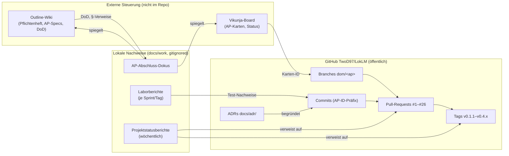
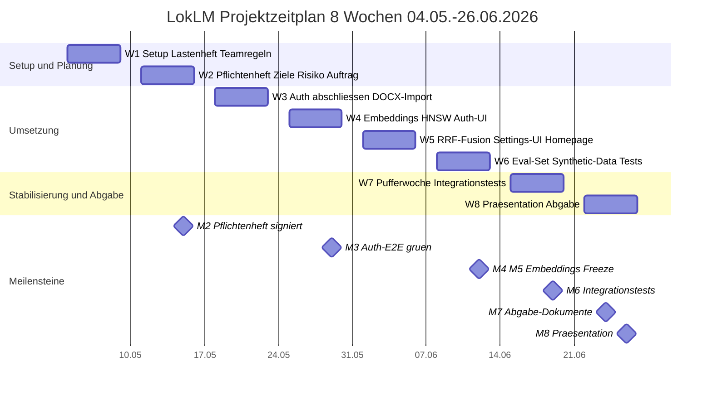
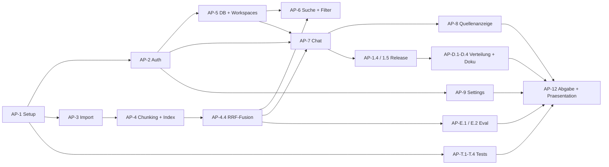

# Projektmanagement — Kanban-Board (Vikunja) und Outline-Dokumentation als Steuerung

Das Projekt LokLM wurde über rund neun Wochen (08.05.2026 bis 14.06.2026) von einem
Zwei-Personen-Team getragen: **Denys Tudosa** (Projekt-Owner, Domänen Chunking, Auth,
RAG, Installer) und **Dominik Furlan** (Dokumentation, Tests, UI/UX). Die Steuerung
lief über drei ineinandergreifende Ebenen: ein **Kanban-Board (Vikunja)** für den
Arbeitsfluss, eine **Wissens-/Spezifikationsdokumentation (Outline)** für Inhalte und
Akzeptanzkriterien, sowie das **GitHub-Repository** als Versionierungs- und
Nachweis-Ebene. Diese Datei beschreibt, wie diese drei Ebenen zusammenspielen und
welche **im Repository nachprüfbaren Artefakte** die externen Werkzeuge spiegeln.

> ⚠️ durch Team zu ergaenzen: Vikunja (Board) und Outline (Wiki) sind **externe,
> selbst gehostete Werkzeuge** und liegen **nicht im Repository**. Der konkrete
> Karten-/Seiten-Detailverlauf (Spalten-Historie, Zeitstempel pro Karte,
> Kommentar-Threads) lässt sich aus den Repo-Quellen nicht rekonstruieren und ist
> durch das Team zu ergänzen. Die folgenden Aussagen zur in-Repo-Spiegelung sind
> belegbar; die Beschreibung der Board-/Wiki-Mechanik ist allgemein gehalten.

## 8.1 Werkzeuglandschaft im Überblick

Tabelle 8.1 gibt einen Überblick der eingesetzten Werkzeuge und ihrer Belegbarkeit aus dem Repository.

**Tabelle 8.1:** Werkzeuglandschaft und Repo-Belegbarkeit.

| Werkzeug                    | Zweck                                                       | Ablageort                                | Belegbarkeit aus dem Repo                      |
| --------------------------- | ----------------------------------------------------------- | ---------------------------------------- | ---------------------------------------------- |
| **Vikunja** (Kanban)        | Arbeitspakete als Karten, Status/Priorität, Sprint-Fluss    | extern, `<PRIVATE_DOMAIN>` (`tasks.<…>`) | nur indirekt (Task-Links in Abschluss-Dokus)   |
| **Outline** (Wiki)          | Pflichtenheft, AP-Spezifikationen, Akzeptanzkriterien, ADRs | extern, `<PRIVATE_DOMAIN>` (`notes.<…>`) | nur indirekt (Seiten-Links in Abschluss-Dokus) |
| **MinIO** (Objektspeicher)  | Release-Backup-Mirror, Bericht-Snapshots                    | extern, `<PRIVATE_DOMAIN>`               | indirekt (Release-Pipeline)                    |
| **GitHub** (`TwoD97/LokLM`) | Code, Daten, Doku, PRs, Tags, CI                            | öffentlich                               | vollständig                                    |

Die internen Domains aller selbst gehosteten Dienste sind im Handbuch durchgängig als
`<PRIVATE_DOMAIN>` maskiert (Outline, Vikunja und MinIO laufen unter derselben
Domain-Familie). In den lokalen Abschluss-Dokus stehen die echten Links als
Arbeitshilfe; diese Dokus sind bewusst gitignored (siehe Abschnitt 8.3).

## 8.2 Kanban-Logik (Vikunja)

> ⚠️ Annahme, bitte pruefen: Die folgende Spalten-/Status-/Prioritätslogik
> beschreibt das **übliche** Vorgehen, wie es sich aus den Abschluss-Dokus und
> Projektstatusberichten ableiten lässt. Die exakte Spaltenkonfiguration des Boards
> ist extern und durch das Team zu bestätigen.

**Karten = Arbeitspakete.** Jede Karte entspricht einem Arbeitspaket (AP) mit einer
festen ID (z. B. `AP-6`, `AP-T.2`, `AP-E.1`). Diese IDs sind im Repo durchgängig
nachvollziehbar — sie tauchen in Commit-Präfixen (`tests , AP-T.1 , …`),
Branch-Namen (`dom/ap-t2-integrationstests`) und PR-Titeln (`AP-E.1 — Eval dev-set`)
auf. Damit ist die Verbindung **Board-Karte ↔ Code** über die AP-ID belastbar, auch
ohne Zugriff auf das Board.

**Spaltenlogik (typisch, durch Team zu bestätigen):** Backlog → In Arbeit → Review →
Fertig. Die Status-Lesart der Projektstatusberichte spiegelt genau diese Stufen
(`projektstatusbericht-2026-06-14.md`):

- „in Arbeit" = noch in Entwicklung, kein PR.
- „PR offen" = umgesetzt, Pull-Request/Review ausstehend (entspricht Spalte _Review_).
- „gemerged/released" = im Integrationsstand `main` bzw. als Release-Tag (Spalte _Fertig_).
- „Branch (lokal/unpushed)" = umgesetzt, aber noch nicht im Abgabestand.

**Priorisierung.** Belege für eine formale Prioritätsskala liegen im Repo nicht vor.
Faktisch wurde nach Meilensteinen/Gates priorisiert (z. B. Gate **G2** = Auth-E2E §8.2
musste grün laufen, siehe `docs/work/laborberichte/Laborbericht_LokLM_2026-05-29.md`).

> ⚠️ Quelle fehlt: Eine explizite, dokumentierte Prioritätsskala (z. B.
> Hoch/Mittel/Niedrig je Karte) ist in den Repo-Quellen nicht belegt — durch Team zu
> ergänzen.

**Task-Querverweise.** In den Abschluss-Dokus sind einzelne Vikunja-Tasks verlinkt
(z. B. AP-T.1 → Task 30; AP-T.2 → „Task AP-T.2"; M3-Auth → Task 17). Ein bereits
dokumentierter Stolperstein: Im Laborbericht 29.05. ist vermerkt, dass ein
Querverweis im Outline-Dokument fälschlich auf `/tasks/18` (RRF-Task des Partners)
statt `/tasks/17` (M3-Auth) zeigte — ein Beispiel dafür, dass Board und Wiki manuell
synchron gehalten werden mussten.

## 8.3 Outline-Dokumentation als Spezifikations- und Abnahme-Ebene

Outline diente als **Single Source of Truth** für Anforderungen und Abnahme:

- **Pflichtenheft / Lastenheft** als zentrale Anforderungsdokumente (Outline-Seite
  „Pflichtenheft"; im Repo zusätzlich `Pflichtenheft_LokLM.md`, allerdings gitignored,
  und `docs/work/# Lastenheft.md`, im README verlinkt).
- **Pro AP eine Outline-Seite** mit den Abschnitten _Kontext_, _Akzeptanzkriterien
  (Definition of Done)_, _Technisches Vorgehen_, _Offene Fragen_, _Status-Update_.
  Die Struktur ist in den lokalen Abschluss-Dokus exakt gespiegelt (siehe unten).
- **Pflichtenheft-Paragrafen** als Referenz: AP-T.1 → §8.1, AP-T.2 → §8.2,
  AP-E.1 → §8.5 (belegt in den jeweiligen Abschluss-Dokus). Diese Paragraf-Verweise
  binden Code-Arbeit eindeutig an eine Anforderung.

### In-Repo-Artefakte, die Vikunja/Outline spiegeln

Damit die externen Werkzeuge nachvollziehbar bleiben (und gegen nachträgliche
Manipulation geschützt sind), existieren im Repo bzw. lokal mehrere Artefakt-Typen (Tabelle 8.2):

**Tabelle 8.2:** In-Repo-/lokale Artefakte, die Vikunja und Outline spiegeln.

| Artefakt              | Pfad                                                    | Funktion                                                                                              | Im Git?            |
| --------------------- | ------------------------------------------------------- | ----------------------------------------------------------------------------------------------------- | ------------------ |
| AP-Abschluss-Dokus    | `docs/work/ap-*-abschluss-doku.md`                      | Copy-Paste-Vorlage 1:1 nach Outline-AP-Seite (Kontext, DoD, Vorgehen, Status) + Vikunja-Status-Update | nein (gitignored)  |
| Partner-Handover      | `docs/work/ap-9-partner-fields.md`                      | offene Felder/Aufgaben an den Partner übergeben                                                       | nein (gitignored)  |
| Projektstatusberichte | `docs/work/projektstatusbericht-<Enddatum>.md`          | wöchentlicher Steuerungsbericht (Status, Termine, Entscheidungen)                                     | nein (gitignored)  |
| Laborberichte         | `docs/work/laborberichte/Laborbericht_LokLM_<Datum>.md` | Tages-/Sprint-Protokoll mit Nachweisen                                                                | nein (gitignored)  |
| ADRs                  | `docs/adr/000X-*.md`                                    | Architektur-Entscheidungen, von Outline referenziert                                                  | **ja** (committed) |

**Warum gitignored?** Der gesamte Ordner `docs/work/` ist in `.gitignore` ausgenommen
(Zeile `docs/work/`). Das ist bewusst: Die Abschluss-Dokus enthalten echte interne
Links (`notes.<PRIVATE_DOMAIN>`, `tasks.<PRIVATE_DOMAIN>`) und sind als
**team-interne Vorlagen** gedacht, die per Copy-Paste in Outline/Vikunja übernommen
werden. Sie bleiben lokal, damit interne Steuerungsdaten nicht ins öffentliche Repo
gelangen. Die ADRs hingegen sind committed, weil sie **technische**
Entscheidungsbelege sind, auf die der Code direkt verweist (z. B. AP-T.1 → ADR-0001
für die Argon2id-statt-PBKDF2-Abweichung).

### Aufbau einer AP-Abschluss-Doku (Beispiel-Struktur)

Die Vorlagen folgen exakt der Outline-Seitenstruktur, damit sie abschnittsweise
übernommen werden können (Beispiel `ap-t1-abschluss-doku.md`):

1. **Kontext** — Pflichtenheft-Paragraf, Vorgänger/Nachfolger-AP.
2. **Akzeptanzkriterien** — Definition of Done als Soll/Ist-Tabelle mit Status.
3. **Technisches Vorgehen** — Ausgangslage, neue/geänderte Dateien, Schlüsselentscheidungen.
4. **Offene Fragen** — an den Partner gemeldete Punkte, CI-Gates.
5. **Fortschritt** — Checkliste.
6. **Links** — Vikunja-Task, Outline-Seite, Pflichtenheft, PR, ADRs.
7. **Status-Update <Datum>** — der Text, der 1:1 als Vikunja-/Outline-Status-Kommentar dient.

## 8.4 Wie die neun Wochen nachvollziehbar werden

Der Projektverlauf ist über mehrere, sich überlappende Spuren dokumentiert — keine
einzelne Quelle trägt allein, aber zusammen ergeben sie eine lückenlose Chronik (Abbildung 8.1):

**Abbildung 8.1:** Zusammenspiel von externer Steuerung, lokalen Nachweisen und GitHub über die AP-ID.

**Drei Nachweis-Spuren:**

1. **Wöchentliche Projektstatusberichte** (`projektstatusbericht-2026-05-22.md`,
   `-2026-06-07.md`, `-2026-06-14.md`) — decken die Wochen 1–6 lückenlos ab,
   anschließend an den jeweils letzten Release-Stand. Jeder Bericht enthält:
   Kurzbeschreibung, Phasen-Detail mit Aufwand pro Punkt, Termin-Soll/Ist-Tabelle,
   nächste Schritte, notwendige Entscheidungen. Bemerkenswert ehrlich: Der Bericht
   vom 07.06. stuft den Gesamtstatus **kritisch** ein (partnerseitiger Ausfall in
   KW 23, nichts integriert/gemerged) und der Folgebericht dokumentiert die Rückkehr
   auf „planmäßig".

2. **Laborberichte je Sprint/Tag** (`Laborbericht_LokLM_2026-05-29.md`,
   `-2026-06-12.md`) — tiefere Tagesprotokolle mit Tagesziele, durchgeführten
   Arbeiten, Ergebnis-Tabelle, Problemen/Erkenntnissen und **konkreten Test-Nachweisen**
   (z. B. „`1 passed (~4,8 s)`" für den §8.2-Auth-E2E auf HW-1). Sie sind in
   `docs/work/laborberichte/` gesammelt.

3. **GitHub selbst** — Commit-Historie mit AP-ID-Präfixen, PR-Verlauf (#1–#26 mit
   echten Merge-Zeitstempeln), Tag-Daten (v0.1.1 am 17.05. bis v0.4.1 am 13.06.).
   Details siehe `09_versioning_and_github_workflow.md`.

> ⚠️ zu verifizieren: Für die Wochen 7–9 (nach 14.06.) liegt im Repo noch kein
> weiterer Projektstatusbericht; der Abschluss dieser Wochen ist durch das Team zu
> ergänzen, sobald die offenen Pakete (AP-E.2 Phase 2, Test-PR-Merges) abgenommen sind.

## 8.5 Verbindung Kanban ↔ Outline ↔ Doku ↔ GitHub

Der Kreislauf, mit dem ein Arbeitspaket von der Karte bis ins `main` läuft:

1. **Karte (Vikunja)** wird mit AP-ID angelegt, Status _Backlog/In Arbeit_.
2. **Spezifikation (Outline)** definiert Kontext + Definition of Done (mit
   Pflichtenheft-§-Verweis).
3. **Branch (GitHub)** `dom/<ap>` wird von `main` abgezweigt; Commits tragen den
   AP-ID-Präfix.
4. **Pull-Request** gegen `main`; Status der Karte → _Review_.
5. **Abschluss-Doku** (`docs/work/`) wird geschrieben: DoD-Soll/Ist, Nachweise,
   Status-Update-Text; dieser Text wandert per Copy-Paste zurück nach Outline
   (Status-Update) und Vikunja (Kommentar).
6. **Merge** nach `main` → Karte _Fertig_; ggf. Release-Tag.
7. Der **Projektstatusbericht** der Woche fasst alle so abgeschlossenen Karten
   zusammen und führt offene als „PR offen"/„in Arbeit".

Diese durchgängige Verkettung über die **AP-ID** ist der Klebstoff: Sie erlaubt es,
von einer Board-Karte über die Outline-Spec und den Branch bis zum konkreten Commit
und Test-Nachweis zu springen, ohne dass eine der Ebenen die alleinige Wahrheit sein
muss.

> ⚠️ durch Team zu ergaenzen: Der genaue Board-Aufbau (Listen, Labels, Sprints in
> Vikunja) sowie die Outline-Seitenhierarchie sind extern und sollten für die Abgabe
> als Screenshot/Export ergänzt werden, da sie aus dem Repo nicht ableitbar sind.

---

## 8.6 Meilensteinplan (PHB K11)

Der Meilensteinplan strukturiert die acht Projektwochen entlang prüfbarer Zwischenstände. Quelle: [Pflichtenheft](../Pflichtenheft.md) §9.3. Tabelle 8.3 listet die acht Meilensteine M1–M8.

**Tabelle 8.3:** Meilensteine M1–M8 mit Datum und Erfüllungskriterium.

| Nr  | Meilenstein                       | Datum      | Erfüllungs-Kriterium                                                    |
| --- | --------------------------------- | ---------- | ----------------------------------------------------------------------- |
| M1  | Projekt-Setup abgeschlossen       | 08.05.2026 | Repo, Toolchain, Lastenheft signiert                                    |
| M2  | Pflichtenheft signiert            | 15.05.2026 | Pflichtenheft freigegeben                                               |
| M3  | Auth-Backend integration-getestet | 29.05.2026 | E2E-Test §8.2 läuft grün                                                |
| M4  | Embeddings + RRF integriert       | 12.06.2026 | RetrievalService liefert RRF-fusionierte Treffer; Eval-Baseline messbar |
| M5  | Feature-Freeze                    | 12.06.2026 | alle Muss + Soll umgesetzt; nur noch Bugfix                             |
| M6  | Integrationstests bestanden       | 19.06.2026 | M1–M11 manuell durchgeführt, dokumentiert                               |
| M7  | Abgabe-Dokumente fertig           | 24.06.2026 | gedruckt + digital, vom Projektleiter freigegeben                       |
| M8  | Präsentation                      | 26.06.2026 | live durchgeführt                                                       |

An drei Meilensteinen hängen **Go/No-Go-Gates** (Pflichtenheft §9.4): **G1** (Ende KW 1, Lastenheft signiert — letzte Scope-Änderung), **G2** (Ende KW 4, Auth-Backend integration-getestet — sonst wird der BGE-M3-Stretch gestrichen) und **G3** (Ende KW 6, Feature-Freeze — entscheidet, ob die Pufferwoche für den QLoRA-Stretch oder reine Stabilisierung genutzt wird).

## 8.7 Zeitplan / GANTT (PHB K12)

Abbildung 8.2 zeigt den Zeitplan über die acht Projektwochen (04.05.–26.06.2026) als GANTT-Diagramm, gegliedert in Setup/Planung, Umsetzung und Stabilisierung/Abgabe, mit den Meilensteinen M2–M8 als Marker. Quelle: Wochenplan [Pflichtenheft](../Pflichtenheft.md) §9.1.

**Abbildung 8.2:** Projektzeitplan (GANTT) über acht Wochen mit Meilensteinen.

## 8.8 Netzplan / Abhängigkeiten

Der Netzplan in Abbildung 8.3 zeigt die Abhängigkeiten zwischen den Arbeitspaket-Gruppen, abgeleitet aus den `Vorgänger`/`Nachfolger`-Spalten des Projektstrukturplans ([Pflichtenheft](../Pflichtenheft.md) §9.2; Details in [Kapitel 10](10_work_package_landscape.md)). Dargestellt ist die **Gruppen-Ebene** (AP-1 … AP-12); der vollständige paketgenaue Vorgänger/Nachfolger-Plan steht im PSP.

**Abbildung 8.3:** Netzplan — Abhängigkeiten der Arbeitspaket-Gruppen.

## 8.9 Kosten- und Aufwandsplan (PHB K13)

Das Vorhaben ist ein reines Schul-/Eigenleistungsprojekt ohne Sach- oder Lizenzkosten; der „Kostenplan" ist daher ein **Aufwandsplan** in Personenstunden. Quelle: [Pflichtenheft](../Pflichtenheft.md) §9.2. Geplant sind **294 Stunden** ohne Stretch, aufgeteilt auf die beiden Teammitglieder (Tabelle 8.4).

**Tabelle 8.4:** Geplanter Aufwand je Teammitglied.

| Posten                                                                                           | Stunden |
| ------------------------------------------------------------------------------------------------ | ------- |
| Denys Tudosa (Code, Architektur, Eval-Harness, Release, Präsentation)                            | 149     |
| Dominik Furlan (Auth-UI, DOCX, Settings-UI, Tests, Doku, Synthetic Data, Homepage, Präsentation) | 145     |
| **Summe geplant (ohne Stretch)**                                                                 | **294** |
| Stretch (Kann) AP-10.1 QLoRA (nur Denys, nur nach G3)                                            | +25     |
| **Summe maximal (mit Stretch)**                                                                  | **319** |

Über acht Wochen entspricht das ca. **18–19 Std/Woche pro Person** — vereinbar mit der schulischen Projektzeit (4 UE/Woche) plus moderater Eigenleistung. Der **paketgenaue Aufwand je AP** ist im Projektstrukturplan ([Kapitel 10](10_work_package_landscape.md)) bzw. der AP-Tabelle (Pflichtenheft §9.2) ausgewiesen.

> WARN zu verifizieren — Die Summe der **einzelnen** AP-Aufwände (inkl. der Nachtrag-v1.1.1-Pakete AP-1.4/1.5, +20 h) liegt bei ~314 h und damit über der Personen-Plansumme von 294 h; die beiden Sichten sind vor der gebundenen Abgabe zu konsolidieren (Personen-Summe laut §9.2 maßgeblich).

Die **tatsächlich** geleisteten Stunden werden im Projektabschlussbericht den geplanten gegenübergestellt (siehe [Kapitel 24](24_current_status_after_9_weeks.md), PHB K15).
