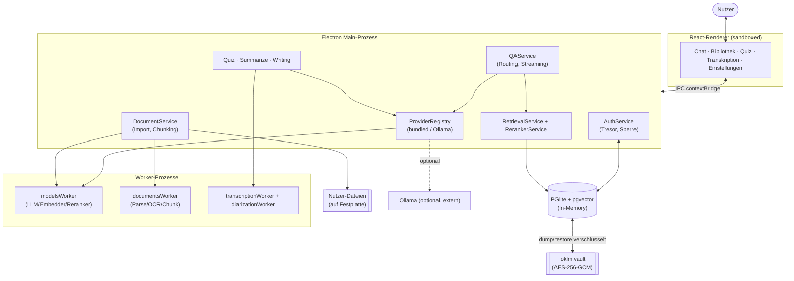

# Systemüberblick

## 12.1 Was ist LokLM?

LokLM ist ein **lokaler, offline lauffähiger KI-Wissensassistent mit Quellenverifikation**. Das System ist eine Electron-Desktop-Anwendung, die auf den Dokumenten des Nutzers eine RAG-Pipeline (Retrieval-Augmented Generation) betreibt: Der Nutzer importiert eigene Dokumente, stellt in natürlicher Sprache Fragen dazu, und erhält Antworten eines lokal laufenden Sprachmodells, die **mit Zitaten auf die zugrundeliegenden Textstellen** belegt sind.

Der zentrale Grundsatz ist **Offline-Fähigkeit**: Alle Modelle (Embedder, Reranker, Sprachmodell, optional Transkription und Übersetzung) laufen als lokale GGUF-Gewichte über `node-llama-cpp` bzw. eigene Sidecar-Prozesse. Es gibt keinen verpflichtenden Cloud-Dienst; einzig ein **optionaler** externer Ollama-Server kann — wenn der Nutzer ihn bei der Installation freigeschaltet hat — als alternative Modellquelle eingebunden werden. Alle Nutzerdaten liegen verschlüsselt in einem lokalen Tresor (`loklm.vault`).

Quellen: [package.json](../../package.json) (`description`, Abhängigkeiten `node-llama-cpp`, `@electric-sql/pglite`, `argon2`), [src/main/index.ts](../../src/main/index.ts).

## 12.2 Hauptmodule auf einen Blick

Das System gliedert sich grob in fünf funktionale Blöcke (Tabelle 12.1):

**Tabelle 12.1:** Funktionale Hauptmodule von LokLM.

| Block | Aufgabe | Wesentliche Bestandteile |
| --- | --- | --- |
| **Auth & Tresor** | Registrierung, An-/Abmeldung, Verschlüsselung aller Nutzerdaten, Auto-Sperre | `AuthService`, AES-256-GCM-Envelope-Encryption, argon2id-KDF |
| **Dokumenten-Pipeline** | Import, Parsing (PDF/Markdown/Text/OCR), Chunking, Einbettung, Ordner-Synchronisation | `DocumentService`, `chunker`, `parser`, `EmbeddingService`, `FolderSyncService` |
| **Retrieval & QA** | Hybride Suche (BM25 + Vektor), Reranking, Routing, Antwort-Streaming mit Zitaten | `RetrievalService`, `RerankerService`, `QAService`, `router` |
| **Weitere KI-Features** | Quiz-Generierung, Zusammenfassung, Schreibhilfe, Transkription, Übersetzung | `QuizService`, `SummarizationService`, `WritingService`, `TranscriptionService`, `TranslationService` |
| **Modell- & Laufzeit-Infrastruktur** | Modell-Download, Geräteplanung (CPU/GPU), Worker-Prozesse, Provider-Abstraktion | `ModelDownloader`, `ResourcePlanner`, `ModelsWorkerClient`, `ProviderRegistry` |

Persistenz erfolgt über eine **In-Memory-PGlite-Datenbank** (PostgreSQL-WASM) mit `pgvector`-Erweiterung und Drizzle-ORM; der gesamte Datenbankstand wird beim Sperren/Beenden verschlüsselt in die Tresordatei geschrieben und beim Entsperren wieder geladen (siehe [src/main/db/database.ts](../../src/main/db/database.ts), [src/main/services/auth/AuthService.ts](../../src/main/services/auth/AuthService.ts)).

## 12.3 Nutzer- und Anwendungsfälle

Die Anwendung deckt mehrere Kern-Anwendungsfälle ab, die alle auf demselben verschlüsselten Dokumentbestand und denselben lokalen Modellen aufsetzen:

**Dokument-Import.** Der Nutzer wählt Dateien (PDF, Markdown, TXT, RST, JSON/YAML/TOML, Bilder) oder einen ganzen Ordner aus. Die Datei wird geparst, bei Bildern bzw. gescannten PDFs per OCR (Tesseract) in Text überführt, in überlappende Chunks zerlegt, sprachlich klassifiziert (`eld`: de/en/other) und eingebettet. Pro Workspace lässt sich ein Ordner als **Sync-Ordner** registrieren, der per `fs.watch` überwacht wird — neue/geänderte/verschwundene Dateien werden automatisch nachgeführt. Belege: [src/main/services/documents/DocumentService.ts](../../src/main/services/documents/DocumentService.ts), [src/main/services/documents/FolderSyncService.ts](../../src/main/services/documents/FolderSyncService.ts), IPC-Kanäle `documents:import`, `workspaces:addSyncFolder`.

**Chat / QA mit Zitaten.** Der Kern-Use-Case. Eine Frage durchläuft Routing (siehe ADR-0003), hybride Retrieval (BM25 + dense + RRF + optional Reranking), Kontext-Packing auf das Modell-Fenster und schließlich ein Token-für-Token-Streaming der Modellantwort. Jede gefütterte Textstelle wird als `citation`-Ereignis vorab gesendet; nur tatsächlich im Antworttext zitierte Belege (Marker `[doc:X, chunk:Y]`) werden persistiert. Belege: [src/main/services/qa/QAService.ts](../../src/main/services/qa/QAService.ts), IPC-Kanal `chat:stream`.

**Quiz.** Aus einer Auswahl von Dokumenten wird ein Multiple-Choice-Fragenset generiert (ein LLM-Aufruf pro chunk-basierter Einheit, Validierung im Code). Decks, Fragen und Versuche werden persistiert und Versuche bewertet. Belege: [src/main/services/quiz/QuizService.ts](../../src/main/services/quiz/QuizService.ts), Tabellen `quiz_decks`/`quiz_questions`/`quiz_attempts` in [src/main/db/schema.ts](../../src/main/db/schema.ts).

**Transkription.** In der App aufgenommenes oder importiertes Audio wird via Whisper (`@kutalia/whisper-node-addon`) transkribiert, optional mit Sprecher-Diarisierung (`sherpa-onnx-node`); das Transkript kann als Dokument in den Workspace gespeichert werden. Belege: [src/main/services/transcription/TranscriptionService.ts](../../src/main/services/transcription/TranscriptionService.ts).

**Suche / Filter (Bibliothek).** Lexikalische Bibliothekssuche (BM25 + `ts_headline`-Hervorhebung) mit Filtern nach Dokumenttyp, Datum und Größe — ein Treffer pro Dokument. Diese Suche ist bewusst von der modellgestützten Retrieval getrennt, damit die Bibliothek durchsuchbar ist, bevor ein Embedder geladen wurde. Beleg: `searchLibrary` in [src/main/db/database.ts](../../src/main/db/database.ts), IPC-Kanal `documents:searchLibrary`.

**Übersetzung & Schreibhilfe.** Optionale Features: Übersetzung ganzer Dokumente oder Textpassagen über einen MADLAD-CTranslate2-Sidecar; DeepL-Write-artige Umformulierung von Text auf dem gebündelten Chat-LLM. Belege: [src/main/services/translation/TranslationService.ts](../../src/main/services/translation/TranslationService.ts), [src/main/services/writing/WritingService.ts](../../src/main/services/writing/WritingService.ts).

## 12.4 Welche Daten bewegen sich durch das System?

- **Quelldateien** bleiben an ihrem Ort auf der Festplatte des Nutzers; der Tresor enthält **keine Kopie** der Originalbytes, sondern nur Pfad, Metadaten und die extrahierten Chunks. Export bedeutet daher „Original im Dateimanager anzeigen" bzw. eine bewusst per Passwort-Gate abgesicherte Kopie. Beleg: IPC-Handler `documents:revealSource`/`documents:exportDocument`.
- **Chunks + Embeddings** (Vektor `vector(1024)`, BGE-M3) liegen in der PGlite-Datenbank, die als Ganzes verschlüsselt im Tresor persistiert wird.
- **Konversationen, Nachrichten, Zitate, Quizze, Einstellungen** liegen ebenfalls in derselben Datenbank.
- **Schlüsselmaterial** (DEK, KEKs) existiert nur im Arbeitsspeicher, in `mlock`-gesichertem, beim Sperren genullten Speicher (siehe ADR-0001/0002 und 13_system_architecture.md).

## 12.5 Übersichtsdiagramm

Abbildung 12.1 zeigt die Grobstruktur des Systems.

**Abbildung 12.1:** Systemüberblick — Renderer, Main-Prozess, Worker-Prozesse, In-Memory-Datenbank und Tresor.

Das Diagramm zeigt die Grobstruktur: Der Renderer kommuniziert ausschließlich über die abgesicherte IPC-Brücke mit dem Main-Prozess; rechenintensive Modell- und Parsing-Arbeit ist in eigene Worker-Prozesse ausgelagert; persistente Daten leben in der In-Memory-Datenbank, die verschlüsselt im Tresor gesichert wird. Die technische Tiefe dazu folgt in Kapitel 13.
