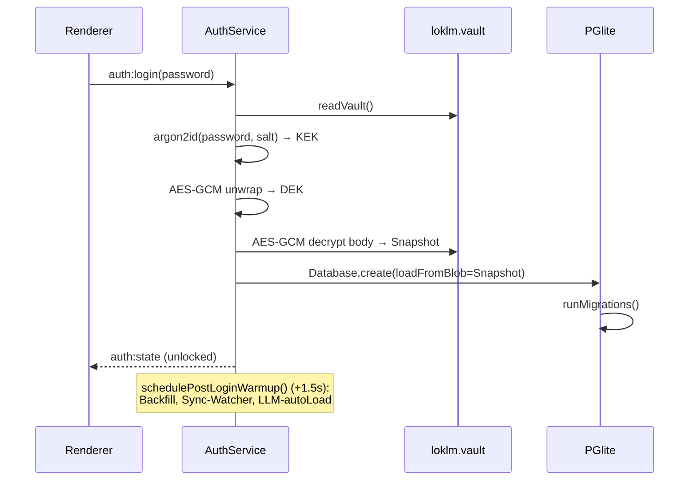
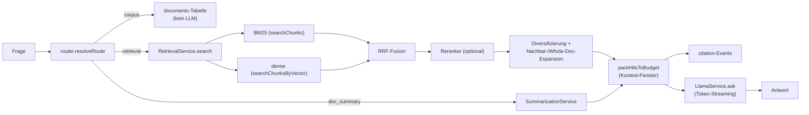
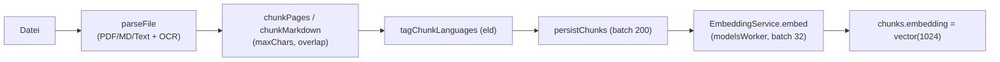

# Technische Architektur

Dieses Kapitel beschreibt die technische Schichtung von LokLM, die Datenflüsse, die Prozess-Topologie und die wichtigsten Architekturentscheidungen. Es setzt den Systemüberblick aus Kapitel 12 voraus.

## 13.1 Schichten und Prozesse

LokLM ist eine Electron-Anwendung [1] mit strikter Prozess-Trennung. Es gibt drei Electron-Standard-Schichten plus eine Reihe ausgelagerter Worker-Prozesse (Tabelle 13.1):

**Tabelle 13.1:** Prozess-Topologie — Electron-Schichten und ausgelagerte Worker-Prozesse.

| Schicht | Prozess | Verantwortung | Quelle |
| --- | --- | --- | --- |
| **Renderer** | Chromium (sandboxed) | React-UI, keine Node-Integration, kein Dateisystemzugriff | [src/renderer/](../../src/renderer/), `sandbox: true` in [src/main/index.ts](../../src/main/index.ts) |
| **Preload** | Chromium-Preload (CommonJS) | `contextBridge`-Brücke `window.api`, einzige erlaubte IPC-Oberfläche | [src/preload/index.ts](../../src/preload/index.ts) |
| **Main** | Node.js (Electron) | Service-Layer, IPC-Handler, Auth/Tresor, Datenbankzugriff | [src/main/index.ts](../../src/main/index.ts), [src/main/services/](../../src/main/services/) |
| **modelsWorker** | utilityProcess | LLM-, Embedder-, Reranker-Inferenz (`node-llama-cpp`) | [src/main/services/workers/modelsWorker.ts](../../src/main/services/workers/modelsWorker.ts) |
| **documentsWorker** | utilityProcess | Parsing, OCR, Chunking | [src/main/services/workers/documentsWorker.ts](../../src/main/services/workers/documentsWorker.ts) |
| **transcriptionWorker** | utilityProcess | Whisper-Transkription | [src/main/services/workers/transcriptionWorker.ts](../../src/main/services/workers/transcriptionWorker.ts) |
| **diarizationWorker** | utilityProcess (lazy) | Sprecher-Diarisierung (`sherpa-onnx`) | [src/main/services/workers/diarizationWorker.ts](../../src/main/services/workers/diarizationWorker.ts) |

Die Worker-Eintrittspunkte sind als eigene Rollup-Inputs in [electron.vite.config.ts](../../electron.vite.config.ts) deklariert und werden zur Laufzeit über `utilityProcess.fork(out/main/<name>.js)` geladen.

### Warum diese Trennung?

- **Renderer-Sandbox als Sicherheitsgrenze:** Die App verarbeitet *untrusted* Inhalte — PDFs durch `pdfjs` [14], OCR-Bilder, Markdown, sowie LLM-Ausgaben, die per `react-markdown` gerendert werden. Die volle Chromium-Sandbox (`sandbox: true`, zusätzlich prozessweit `app.enableSandbox()`) hält einen möglichen Renderer-Exploit vom Dateisystem und vom entschlüsselten Tresor in Main fern. Da sandboxed Preloads keine ES-Module laden können, wird der Preload bewusst als CommonJS (`index.cjs`) gebaut.
- **Modell-Inferenz im eigenen Prozess:** Schwere GGUF-Loads und Inferenz liefen früher auf dem Main-Thread und blockierten dort den Event-Loop (u. a. die VRAM-Probe bei `getLlama`-Init). Sie sind in den `modelsWorker` ausgelagert; eine FIFO-Mutex dort serialisiert die `loadModel`-Aufrufe über LLM/Embedder/Reranker. Damit `node-llama-cpp` im Utility-Process die GPU-Binaries korrekt validiert (der Test-Kindprozess startete dort sonst als Electron statt als Node und scheiterte → stiller CPU-Fallback trotz verfügbarer CUDA-GPU), wird `ELECTRON_RUN_AS_NODE=1` im Worker gesetzt (`eba08e3`).
- **Parsing isoliert vom Inferenz-Pfad:** Ein schweres oder gescanntes PDF darf das Token-Streaming des Chats nicht stören — daher ein separater `documentsWorker`. Transkription und Diarisierung erhalten je einen eigenen Prozess, isoliert sowohl vom Modell- als auch vom Parsing-Pfad.

Belege für die Prozess-Topologie: Konstruktion von `ModelsWorkerClient`, `DocumentsWorkerClient`, `TranscriptionWorkerClient`, `DiarizationWorkerClient` in [src/main/index.ts](../../src/main/index.ts) (Z. 169–181).

## 13.2 IPC-Oberfläche

Die Renderer-↔-Main-Kommunikation läuft ausschließlich über `ipcRenderer.invoke`/`ipcMain.handle` und Event-Sends. Der Preload exponiert eine typisierte `window.api`-Fassade ([src/preload/index.ts](../../src/preload/index.ts)); kein roher `ipcRenderer`-Zugriff verlässt den Preload. Die Handler sind in `registerIpc()` ([src/main/index.ts](../../src/main/index.ts)) registriert und decken thematisch ab:

`auth:*`, `window:*`, `workspaces:*`, `documents:*`, `conversations:*`, `models:*`, `embedder:*`, `reranker:*`, `llm:*`, `search:*`, `chat:*`, `transcription:*`, `settings:*`, `ollama:*`, `quiz:*`, `translation:*`, `writing:*`, `logs:*`.

Eine maschinelle Zählung über `ipcMain.handle(` in [src/main/index.ts](../../src/main/index.ts) ergibt **105 Handler** (Stand 2026-06-14).

Streaming-Kanäle (Chat, Quiz, Transkription, Modell-Download) arbeiten mit pro-Stream-IDs: Der Handler `chat:stream` sendet Token/Citation/Stage-Ereignisse auf einem dynamischen Kanal `chat:stream-event:<streamId>`, abbrechbar über `chat:cancel` per `AbortController`. Status-Pushes (`llm:status`, `embedder:status`, `reranker:status`, `auth:state`, `provider:fallback`) werden an **alle** offenen Fenster gesendet.

## 13.3 Lokale vs. externe Komponenten

Tabelle 13.2 stellt die lokal gebündelten Standard-Komponenten den optionalen externen gegenüber.

**Tabelle 13.2:** Lokale Standard- gegenüber optionalen externen Komponenten.

| Komponente | Standard | Extern (optional) |
| --- | --- | --- |
| Sprachmodell (LLM) | gebündeltes GGUF (`node-llama-cpp`) | Ollama-LLM (`OllamaLlmProvider`) |
| Embedder | BGE-M3 GGUF | Ollama-Embedder |
| Reranker | BGE-Reranker-v2-M3 GGUF | Ollama-Reranker |
| Übersetzung | MADLAD-Sidecar (CTranslate2) | — |
| Transkription | Whisper (lokales Addon) | — |
| Datenbank | PGlite (In-Memory, WASM) | — |

Die Quellenumschaltung kapselt die **`ProviderRegistry`** ([src/main/services/providers/Registry.ts](../../src/main/services/providers/Registry.ts)): Sie hält je ein `bundled`/`ollama`-Paar für LLM, Embedder und Reranker und entscheidet pro Aufruf, welcher Provider aktiv ist. Bei einem Netzwerk-/Timeout-/Server-Fehler eines Ollama-LLM/Reranker fällt sie **automatisch auf den gebündelten Provider zurück** (`onFallback`-Event, das die Chat-Header-Pille auf „bundled, fallback aktiv" umschaltet).

Der externe Ollama-Connector ist **doppelt gesichert**: Er ist nur nutzbar, wenn er bei der Installation im Wizard freigeschaltet wurde (Tier-Marker `ollamaConnector`, [src/main/services/tier/TierMarker.ts](../../src/main/services/tier/TierMarker.ts)), und ein nicht-loopback `baseUrl` erfordert zusätzlich die explizite Freigabe `allowRemoteOllama` (Loopback-Gate als Defense-in-Depth, [src/main/index.ts](../../src/main/index.ts) `applySettings`).

## 13.4 Datenhaltung: PGlite + pgvector + Drizzle

Die Persistenz nutzt eine **In-Memory-PGlite-Instanz** [3] (PostgreSQL kompiliert nach WASM) mit der `vector`-Erweiterung (pgvector [4]), angesprochen über Drizzle-ORM [5] ([src/main/db/database.ts](../../src/main/db/database.ts)). Die Datenbank ist bewusst in-memory: Die dauerhafte Persistenz ist der verschlüsselte Snapshot im Tresor, nicht ein Verzeichnis auf der Platte. Beim Entsperren wird der Snapshot dechiffriert und über `loadDataDir` eingespielt; beim Sperren/Beenden ruft `AuthService` `dump()`, verschlüsselt das Ergebnis (AES-256-GCM [7], ADR-0002) und schreibt es zurück.

Das Schema ([src/main/db/schema.ts](../../src/main/db/schema.ts)) umfasst die Tabellen `workspaces`, `workspace_sync_folders`, `documents`, `chunks`, `conversations`, `messages`, `citations`, `settings`, `quiz_decks`, `quiz_questions`, `quiz_attempts`, `document_tags`. Die Migrationen sind zweigeteilt: generierte Drizzle-Migrationen aus `drizzle/` **und** rohe SQL-Extras (`0001`–`0010`) unter [src/main/db/migrations/](../../src/main/db/migrations/), die nach den Drizzle-Migrationen ausgeführt werden ([src/main/db/migrate.ts](../../src/main/db/migrate.ts)). Die rohen Migrationen liefern u. a. Trigger/Funktionen, den HNSW-Vektorindex, die FTS-Spalten, Sync-Metadaten, die 3NF-Normalisierung, Chunk-Sprache, Dokument-Summary und Summary-Embedding.

Wesentliche Retrieval-relevante DB-Operationen: `searchChunks` (bilinguale BM25, `ts_rank_cd`), `searchChunksByVector` (HNSW-Cosine), `searchDocumentsByTheme` / `topDocumentsBySummarySimilarity` (Corpus-Route + Summary-Index, ADR-0003), `searchLibrary` (AP-6 lexikalisch mit `ts_headline`).

## 13.5 Datenflüsse

### Login / Entsperren

Abbildung 13.1 skizziert den Ablauf vom Passwort bis zur entsperrten Datenbank.

**Abbildung 13.1:** Login-/Entsperr-Datenfluss — Argon2id-Schlüsselableitung und AES-GCM-Entschlüsselung des Tresor-Snapshots.

### Chat-Anfrage (RAG mit Zitaten)

Abbildung 13.2 zeigt den Retrieval-gestützten Antwortpfad mit Zitaten.

**Abbildung 13.2:** Chat-Anfrage als RAG-Datenfluss — Routing, hybrides Retrieval, RRF-Fusion, optionaler Reranker und Token-Streaming.

Der Chat-Pfad ist bewusst **regex-first** (Routing ohne LLM auf dem Hot-Path) und degradiert sauber: fehlt ein Embedder, läuft Retrieval BM25-only; fehlt der Reranker, bleibt die RRF-Reihenfolge (Reciprocal Rank Fusion [8]). Belege: [src/main/services/qa/QAService.ts](../../src/main/services/qa/QAService.ts), [src/main/services/retrieval/RetrievalService.ts](../../src/main/services/retrieval/RetrievalService.ts).

### Dokument-Import

Abbildung 13.3 stellt die Import-Pipeline von der Datei bis zum Vektor dar.

**Abbildung 13.3:** Dokument-Import-Pipeline — Parsing/OCR, Chunking, Sprach-Tagging, Persistenz und Embedding.

Parsing/OCR/Chunking laufen im `documentsWorker`, das Embedding im `modelsWorker`. Eine beschränkte Indexierungs-Queue (max. 2 gleichzeitige Jobs) verhindert, dass das Ablegen eines ganzen Ordners N Pipelines gleichzeitig startet. Beleg: [src/main/services/documents/DocumentService.ts](../../src/main/services/documents/DocumentService.ts) (`MAX_CONCURRENT_INDEXING = 2`).

## 13.6 Wichtige Architekturentscheidungen (ADRs)

Die zentralen Entscheidungen sind in `docs/adr/` dokumentiert (Tabelle 13.3):

**Tabelle 13.3:** Architektur-relevante Architecture Decision Records (ADRs).

| ADR | Thema | Status | Architektur-Bezug |
| --- | --- | --- | --- |
| [ADR-0001](../../docs/adr/0001-argon2id-password-kdf.md) | argon2id als Passwort-/Passphrase-KDF | accepted | Schlüsselableitung im AuthService |
| [ADR-0002](../../docs/adr/0002-envelope-encryption-aes-gcm.md) | Envelope-Encryption: DEK + KEK-Wrapping (AES-256-GCM) | accepted | Tresor-Format v4, ein-Datei-Layout |
| [ADR-0003](../../docs/adr/0003-query-routing-und-summary-index.md) | Query-Routing + Per-Dokument-Summary-Index | accepted | corpus/doc_summary/retrieval-Routen, Decomposition |
| [ADR-0004](../../docs/adr/0004-adaptive-model-residency.md) | Adaptive Modell-Residency (Usage-Lernen, GDSF-Caching) | proposed | Design-Vorschlag, nicht implementiert |

ADR-0004 „Adaptive Model Residency" ist ein **Design-Vorschlag (ADR-0004, Status PROPOSED) — im aktuellen Stand NICHT implementiert** (kein `src/main/.../placement/`-Code vorhanden). Heute ist das Placement statisch: `ResourcePlanner` entscheidet einmal zur Ladezeit; Embedder/Reranker bleiben nach dem ersten Load warm, nur das LLM hat eine Idle-Eviction (Default 30 min, `LOKLM_LLM_IDLE_MS`).

ADR-0004 beschreibt eine geplante Schichtenarchitektur (UsageJournal, DemandModel, PlacementPolicy, ResidencyManager, SpeculativePreloader). Davon ist zum Handbuchstand **nichts gebaut**: Es existiert kein Verzeichnis `src/main/services/placement/`, und keines der Symbole `ResidencyManager` / `UsageJournal` / `DemandModel` / `PlacementPolicy` / `SpeculativePreloader` kommt im Code vor (grep leer). Die im ADR genannten `src/main/services/placement/*`-Dateien sind dort als „geplant, neu" markiert.

## 13.7 Laufzeitumgebung und Abhängigkeiten

- **Node ≥ 24**, **pnpm 10.x** (Package-Manager), TypeScript 5.6, Electron 42, `electron-vite` [10] als Build-Werkzeug. Belege: `engines` und `packageManager` in [package.json](../../package.json).
- **Native Module:** `node-llama-cpp` [2] (LLM/Embedder/Reranker), `argon2` (Argon2id-KDF [6]), `sodium-native` (Secure-Memory) [16], `@kutalia/whisper-node-addon`, `sherpa-onnx-node`, `sharp`/`@napi-rs/canvas`/`tesseract.js` (Bild/OCR), `@electric-sql/pglite` + `pgvector`. Diese werden über `pnpm.onlyBuiltDependencies` und `electron-rebuild` für Electron gebaut.
- **CSP:** Die ausgelieferte Content-Security-Policy ist strikt (`script-src 'self'`); nur unter `electron-vite dev` wird sie für HMR/react-refresh gelockert (Plugin `cspDevRelax`, `apply: 'serve'`), sodass die Lockerung nie in einen Build leckt. Beleg: [electron.vite.config.ts](../../electron.vite.config.ts).
- **Web-Härtung:** `setWindowOpenHandler` öffnet externe Links nur für `http(s)`/`mailto` im OS-Browser; `will-navigate` blockt jede Top-Level-Navigation außer Dev-Server/Reload; Webviews sind deaktiviert. Beleg: `web-contents-created`-Handler in [src/main/index.ts](../../src/main/index.ts).
- **Single-Instance-Lock:** Nur ein Prozess darf den Tresor anfassen — `app.requestSingleInstanceLock()` verhindert ein Wettrennen zweier Instanzen auf `loklm.vault.tmp`.
