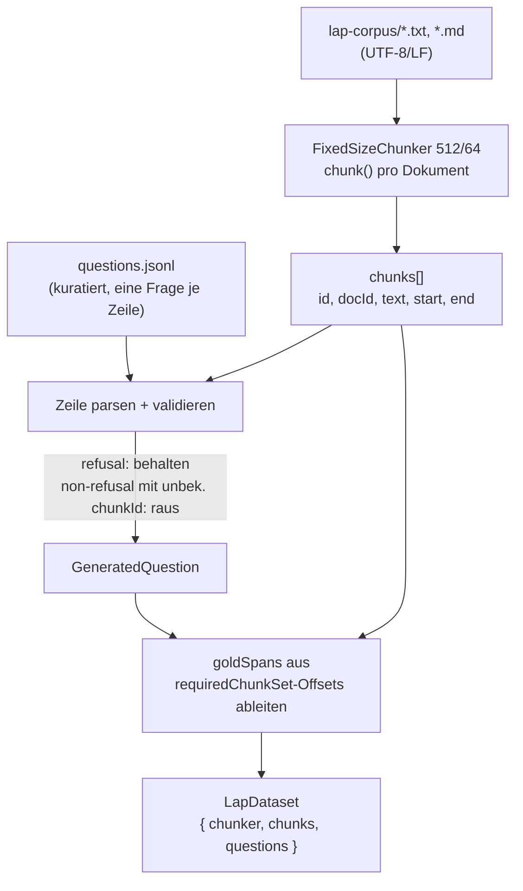

# 15 — Datenpipeline und Eval-Datensätze

Dieses Kapitel beschreibt, wie aus Roh-Dokumenten verarbeitbare Eingaben für das RAG-System (Kapitel 16) und für die Eval-Matrix (Kapitel 17) werden: die Datenquellen, die Chunking-Stufe, der Aufbau des LAP-Eval-Datensatzes mit Gold-Spans, sowie die Speicherorte, Datenqualitäts-Risiken und aktuellen Grenzen.

Es gibt im Projekt **zwei getrennte Daten-Welten**, die nicht verwechselt werden dürfen:

| Welt | Zweck | Chunker | Speicher |
| --- | --- | --- | --- |
| **Produktiv-Pipeline** | Nutzer-Dokumente in der Desktop-App | `chunkPages` / `chunkMarkdown` (`src/main/services/documents/chunker.ts`) | verschlüsselte lokale DB (PGlite/Vault) |
| **Eval-Pipeline** | reproduzierbare Mess-Datensätze | `FixedSizeChunker` (`tests/evals/pipeline/Chunker.ts`) | gitignored JSON unter `tests/evals/data/` |

Beide chunken Text, verfolgen aber unterschiedliche Ziele: die Produktiv-Pipeline optimiert auf Lesbarkeit und Zitierbarkeit (Seiten-/Überschriften-Provenienz), die Eval-Pipeline auf deterministische, chunker-unabhängig vergleichbare Char-Offsets.

---

## 15.1 Datenquellen

### Produktiv-Dokumente (App)

Die App verarbeitet Nutzer-Dokumente (PDF, Markdown, Plaintext). Der Produktiv-Chunker kennt zwei Wege:

- **`chunkPages`** (`chunker.ts`) — für PDFs und unstrukturierten Text. Arbeitet seitenweise, schreibt `pageFrom`/`pageTo` pro Chunk; die Citation rendert daraus eine Seitenangabe.
- **`chunkMarkdown`** (`chunker.ts`) — abschnittsweise (Heading + Body). Abschnittsgrenzen werden **nie** überschritten, damit das LLM eine konkrete Überschrift statt „S. 5" zitieren kann. Jeder Chunk trägt einen `headingPath` (hierarchischer Breadcrumb), der in der Citation als „§ A › B" erscheint.

Die Standard-Parameter des Produktiv-Chunkers sind `maxChars: 2000`, `overlap: 200` (`DEFAULT` in `chunker.ts`). Die Aufteilung läuft über eine Separator-Kaskade (`\n\n\n` → `\n\n` → `\n` → `. ` → … → ` `), die zuerst an den „natürlichsten" Grenzen trennt und erst als letztes Mittel hart auf Zeichenebene schneidet.

### Eval-Korpora

Für die Messung (Kapitel 17) gibt es mehrere Korpora unter `tests/evals/data/`. Relevant für Cluster D ist primär das **LAP-Korpus** (siehe 15.2). Daneben existieren historische Eval-Datensätze unter `tests/evals/data/datasets/` (u. a. `focused-260q…`, `xquad-de-300q…`, `wikipedia-survival-1255q…`), die frühere Sweeps gespeist haben und nicht alle das volle LAP-Schema (Intent/Spans/Refusal) tragen.

> ⚠ Annahme, bitte pruefen — Die historischen Datensätze (`focused-260q`, `xquad-de`, `wikipedia-survival`) stammen aus früheren Generierungs-Läufen und sind nicht Teil der LAP-Matrix-Bewertung. Sie sind hier nur der Vollständigkeit halber genannt; maßgeblich für AP-E.2 ist das LAP-Dataset.

---

## 15.2 LAP-Korpus

Das **LAP-Korpus** ist die Datenbasis der Eval-Matrix (Kapitel 17). Es besteht aus realen, deutsch- und englischsprachigen Dokumenten.

| Kennzahl | Wert | Quelle |
| --- | --- | --- |
| Anzahl Dokumente | ~90 (DE/EN) | Projektangabe (Korpus gitignored) |
| Speicherort Korpus | `tests/evals/data/lap-corpus/` (`.txt`/`.md`) | `build-lap-dataset.ts` Default |
| Referenz-Chunker | `FixedSizeChunker` 512/64 | `REFERENCE_CHUNKER` in `build-lap-dataset.ts` |
| Chunks gesamt | ~2322 | Projektangabe (aus Korpus + 512/64-Chunking) |

> ⚠ Quelle fehlt — Das LAP-Korpus (`tests/evals/data/lap-corpus/`) und die kuratierte Fragen-JSONL sind **gitignored** und liegen nicht im eingecheckten Repo-Stand vor. Die Kennzahlen ~90 Dokumente und ~2322 Chunks stammen aus der Projektangabe und konnten gegen den aktuellen Arbeitsstand nicht direkt nachgezählt werden. Vor der finalen Abgabe sind sie aus dem dann gebauten LAP-Dataset (Feld `chunks.length`) zu verifizieren.

### Bereinigung — UTF-8/LF kritisch für Char-Offsets

Der LAP-Datensatz trägt **Char-Offsets** (`start`/`end`) für jeden Chunk und für jeden Gold-Span. Diese Offsets sind Positionen im Quelltext und damit **byte-/encoding-sensibel**:

- Die Dokumente werden mit `readFile(..., 'utf-8')` gelesen (`build-lap-dataset.ts`). Eine Datei mit BOM, CRLF-Zeilenenden oder Latin-1-Resten würde die Zeichenpositionen gegenüber dem reinen UTF-8/LF-Text verschieben — und damit alle Gold-Spans um einige Zeichen verfehlen.
- Deshalb ist die Vorbedingung: **alle Korpus-Dateien als UTF-8 mit LF-Zeilenenden**. Wird das nicht eingehalten, sind die Span-Metriken (Kapitel 17) systematisch verzerrt, ohne dass ein Fehler geworfen wird — ein stiller Datenqualitäts-Fehler.

> ⚠ zu verifizieren — Eine automatisierte Normalisierung (BOM-Strip, CRLF→LF) ist im aktuellen `build-lap-dataset.ts` **nicht** kodiert; die Pipeline verlässt sich darauf, dass die Korpus-Dateien bereits sauberes UTF-8/LF sind. Ein expliziter Normalisierungs-Pass wäre eine sinnvolle Härtung.

### Chunking (Eval) — FixedSizeChunker 512/64 mit Offsets

Der Eval-Referenz-Chunker (`FixedSizeChunker`, `tests/evals/pipeline/Chunker.ts`) arbeitet bewusst simpler als der Produktiv-Chunker:

- **Fixed-Size + Overlap** über ein gleitendes Zeichenfenster. Schrittweite `step = size − overlap`.
- Standard der Matrix: `size = 512`, `overlap = 64` (`fixed-512-64`).
- Jeder Chunk erhält `id = "<docId>::<index>"`, `start`/`end` (rohe Fenstergrenzen) und `text` (der getrimmte Slice).
- Der letzte Chunk bricht ab, sobald das Fenster das Dokumentende erreicht (kein redundanter Tail-Chunk).

Der entscheidende Punkt: `start`/`end` sind die **rohen Fenstergrenzen** vor dem `trim()`. Das ist die Grundlage dafür, dass eine einzige Gold-Wahrheit (siehe unten) gegen **jede** Chunk-Größe bewertet werden kann (Span-Metriken, Kapitel 17.4). Würde man den Chunker tauschen, ändern sich die `chunkId`s — die Char-Offsets der Gold-Spans bleiben aber gültig.

---

## 15.3 Dataset-Erstellung — build-lap-dataset.ts → LapDataset

Der Konverter `tests/evals/synth/build-lap-dataset.ts` baut aus Korpus + kuratierten Fragen ein `LapDataset`:

Ablauf im Detail (`buildLapDataset`):

1. **Chunking**: alle `.txt`/`.md` im Korpus-Dir werden sortiert gelesen und mit dem Referenz-Chunker (512/64) zerlegt. Ergebnis: `chunks[]`.
2. **Fragen einlesen**: die kuratierte JSONL wird Zeile für Zeile geparst. Jede Zeile ist ein Objekt mit `chunkId`, `question` und optional `requiredChunkIds`, `intent`, `lang`, `expectedRefusal`, `expectedAnswerSubstring`.
3. **Validierung** (Kurations-Disziplin):
   - **Refusal-Fragen** (`expectedRefusal: true`) haben keine Antwort im Korpus → sie behalten ihren (ggf. ungültigen) `chunkId` und werden **bewusst behalten**; die Antwort-/Judge-Phase prüft, ob das System korrekt ablehnt.
   - **Nicht-Refusal-Fragen mit unbekanntem `chunkId`** sind Kurationsfehler → werden verworfen.
4. **Gold-Span-Auflösung**: für jede Frage werden über `requiredChunkSet(q)` die zugehörigen Chunks nachgeschlagen und deren `start`/`end`-Offsets als `goldSpans` (`{ docId, start, end }`) übernommen.
5. **Schreiben**: `{ generator, generatedAt, chunker, chunks, questions }` als JSON unter `tests/evals/data/datasets/lap-<stamp>.json`.

Bemerkenswert: `goldSpans` und `meta` werden **nicht** aus dem Input übernommen, sondern aus den Chunk-Offsets **neu abgeleitet** (`build-lap-dataset.ts`). Damit kann eine kuratierte Frage nie eine inkonsistente Span-Angabe ins Dataset einschleusen — die Spans folgen immer den tatsächlichen Chunk-Grenzen.

---

## 15.4 Gold-Wahrheit — Gold-Chunks, Gold-Spans, Intent

Jede Frage trägt eine mehrstufige Ground-Truth (`GeneratedQuestion` in `tests/evals/synth/QuestionGenerator.ts`):

| Feld | Bedeutung | Verwendung |
| --- | --- | --- |
| `chunkId` | der **eine** Gold-Chunk (single-relevant) | `recall@k`, `MRR`, `nDCG@10` (Kapitel 17.4) |
| `requiredChunkIds` | Set aller Chunks für eine **vollständige** Antwort | `recallRequired@k` (multi-relevant) |
| `intent` | `focused` \| `broad` \| `summary` | wählt Judge-Prompt + erklärt erwartete Breite |
| `goldSpans` | chunker-**unabhängige** Char-Offsets der required-Chunks | Span-Metriken (chunker-frei) |
| `lang` | `de` \| `en` | DE/EN-Auswertung |
| `expectedRefusal` | erwartet das System eine Ablehnung? | Refusal-Prüfung |
| `expectedAnswerSubstring` | Kern-Phrase einer korrekten Antwort | optionale Judge-Hilfe |

Der `intent`-Wert spiegelt bewusst die Heuristik `classifyQueryBreadth` aus der Produktiv-Pipeline (`focused`=3, `broad`=8, `summary`=12 Chunks, siehe Kapitel 16) — so kann die Eval direkt messen, ob das adaptive-topK-Heuristik die richtigen Fragen erwischt.

`requiredChunkSet(q)` ist der Backward-Compat-Helfer: fehlt `requiredChunkIds`, fällt er auf `[chunkId]` zurück. Dadurch reduziert sich `recallRequired@k` für single-relevant-Fragen exakt auf `recall@k`.

### Fragenmenge

| Kennzahl | Wert | Quelle |
| --- | --- | --- |
| DE-Fragen gesamt | 163 | Projektangabe |
| davon beantwortbar | 148 | Projektangabe |
| davon Refusal | 15 | Projektangabe |

> ⚠ Quelle fehlt — Die kuratierte LAP-Fragen-JSONL ist gitignored und im aktuellen Repo-Stand nicht vorhanden; die im Repo liegenden Staging-Batches (`tests/evals/data/staging/questions/batch-0*.jsonl`, zusammen 260 Fragen ohne `lang`/`intent`/`expectedRefusal`) gehören zu einem **älteren** Datensatz (`focused-260q`), **nicht** zum LAP-Set. Die Zahlen 163 / 148 / 15 stammen aus der Projektangabe und sind vor der Abgabe aus dem gebauten LAP-Dataset zu verifizieren (z. B. über die Felder `questions.length` und die Summe der `expectedRefusal`-Flags).

---

## 15.5 Speicherorte (gitignored)

| Artefakt | Pfad | Status |
| --- | --- | --- |
| LAP-Korpus (Roh-Dokumente) | `tests/evals/data/lap-corpus/` | gitignored, nicht im Repo |
| Gebaute Datasets | `tests/evals/data/datasets/lap-<stamp>.json` | Datasets liegen lokal; LAP nicht eingecheckt |
| Korpus-Provenienz | `tests/evals/data/corpora/README.md` (+ Manifest) | eingecheckt (Provenienz bleibt) |
| Eval-Reports / Runs | `tests/evals/report/runs/<stamp>_<sha>/` | lokal pro Lauf |

Der Grund für das Gitignoren des Korpus: die Roh-Dokumente sind teils urheberrechtlich geschützt bzw. nicht zur Weiterverteilung freigegeben, und das Dataset-JSON **bettet die Chunk-Texte bereits ein** (siehe `.gitignore`-Kommentar bei `corpora/`). Eingecheckt bleibt nur die Provenienz (README + Manifest), damit nachvollziehbar ist, woher der Korpus stammt, ohne ihn mitzuliefern.

---

## 15.6 Datenqualitäts-Risiken

| Risiko | Wirkung | Gegenmaßnahme / Status |
| --- | --- | --- |
| **Encoding-Drift** (BOM, CRLF, Latin-1) | verschiebt Char-Offsets → Gold-Spans verfehlen still | manuell sicherzustellendes UTF-8/LF; kein Auto-Normalisierer (offen) |
| **Kurationsfehler** (falscher/unbekannter `chunkId`) | Frage fällt still aus dem Dataset | Konverter verwirft non-refusal-Fragen mit unbekanntem `chunkId` |
| **Inkonsistente Spans** | Span-Metrik misst Falsches | Spans werden aus Chunk-Offsets **neu abgeleitet**, nicht aus Input übernommen |
| **Chunk-Größen-Mismatch** | falsche `chunkId`-Bezüge | Dataset-Chunker (512/64) muss zur Matrix-Chunker-Achse passen (Kapitel 17) |
| **Refusal-Fragen ohne gültigen Gold-Chunk** | kein Span/Recall messbar | bewusst behalten; nur in der Refusal-/Judge-Phase ausgewertet |
| **Sprach-Ungleichgewicht** | DE/EN-Auswertung verzerrt | `lang`-Feld erlaubt getrennte Auswertung; LAP ist überwiegend DE |

---

## 15.7 Aktuelle Grenzen

- **Korpus nicht eingecheckt** — die Reproduzierbarkeit hängt am lokalen Vorhandensein von `lap-corpus/`. Ohne das Korpus lässt sich das LAP-Dataset nicht neu bauen, nur das fertige Dataset-JSON weiterverwenden.
- **Ein einziger Eval-Chunker auf der Matrix-Achse** — der Matrix-Lauf re-chunkt **nicht** pro Config (er nutzt die vor-gechunkten `dataset.chunks`). Eine echte Chunk-Größen-Achse läuft daher als **separate Läufe** (pro Größe ein eigenes Dataset bauen) und wird über die chunker-unabhängige Span-Metrik verglichen (`MATRIX_CHUNKER_SPECS` in `tests/evals/answer/matrix-manifest.ts`, siehe Kapitel 17).
- **Produktiv- vs. Eval-Chunker divergieren** — der Produktiv-Chunker (section-aware Markdown, seitenbasierte PDFs, 2000/200) ist **nicht** identisch mit dem Eval-Chunker (fixed 512/64). Die Eval misst also die Retrieval-Qualität auf einem standardisierten, nicht auf dem produktiven Chunking. Das ist für einen kontrollierten Vergleich gewollt, bedeutet aber, dass die Eval-Zahlen nicht 1:1 die App-Erfahrung abbilden.
- **Keine automatische Korpus-Validierung** — Encoding/LF, Doppelungen und leere Dokumente werden nicht systematisch geprüft (offene Härtung).

---

*Querverweise: Chunking-Produktiv → Kapitel 16 (RAG-Pipeline); Gold-Spans/Metriken → Kapitel 17 (Eval-Matrix); Modelle/Lizenzen der Eval → Kapitel 18.*
