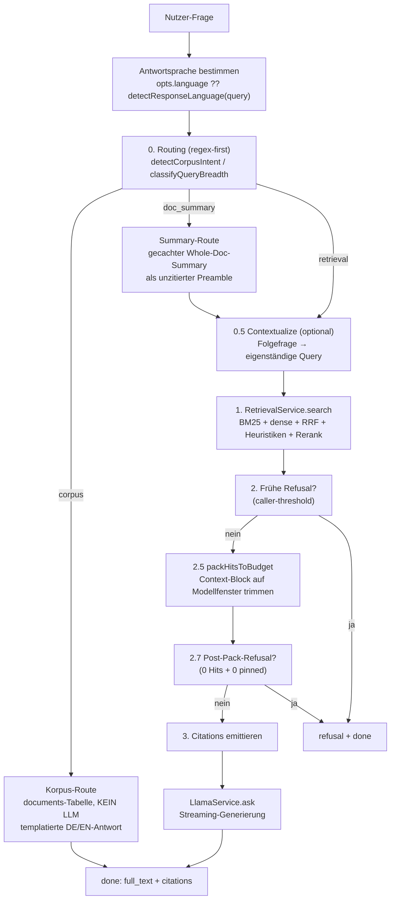
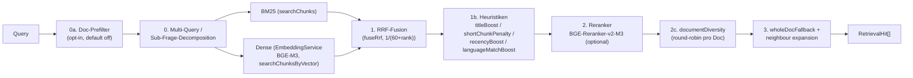

# 16 — RAG- und KI-Pipeline

Dieses Kapitel beschreibt das Herzstück der App: wie eine Nutzer-Frage zu einer **belegten, zitierten Antwort** wird — oder zu einer sauberen Ablehnung, wenn die Dokumente die Antwort nicht hergeben. Es behandelt den End-to-End-Fluss, die Routing-Logik, die Refusal-Mechanik, die Provider-/Bridge-Architektur, die Modellrollen sowie Grenzen und Risiken.

Alle Pfadangaben sind repo-relativ (`src/main/services/...`).

---

## 16.1 RAG-Grundidee

LokLM ist ein **Retrieval-Augmented-Generation**-System über die **eigenen** Dokumente des Nutzers, vollständig lokal/offline. Die Kernregel: das LLM darf nur aus den tatsächlich abgerufenen Dokument-Ausschnitten antworten und muss jeden Beleg mit einem `[doc:<id>, chunk:<id>]`-Marker zitieren. Findet das Retrieval nichts Belastbares, lehnt das System ab, statt zu halluzinieren. Das ist der Kern der Quellenverifikation, die das Projekt verspricht.

Der gesamte Hot Path ist **regex-/heuristik-first**: vor dem eigentlichen Retrieval läuft **kein** LLM-Call (ADR-0003). Auf der CPU-Variante (Lite-Profil) ist das essenziell, weil jeder zusätzliche LLM-Pass Sekunden kostet.

---

## 16.2 End-to-End-Fluss (`QAService.answer`)

Einstiegspunkt ist `QAService.answer(workspaceId, query, opts, abortSignal)` (`src/main/services/qa/QAService.ts`). Die Methode ist ein **AsyncIterable** von Stream-Events (`stage`, `citation`, `token`, `refusal`, `done`, `error`) — der Renderer konsumiert sie live, der Eval-Harness sammelt sie zu einem Endergebnis.

Abbildung 16.1 zeigt den End-to-End-Fluss von der Nutzer-Frage bis zur Antwort.

**Abbildung 16.1:** End-to-End-Fluss in `QAService.answer`.

Die Stufen im Einzelnen:

**0 — Routing.** Nur wenn ein Routen-Muster greift (Korpus-Intent **oder** Summary-Breite), wird `resolveRoute` aufgerufen; sonst bleibt die Route `retrieval`. Details in 16.3.

**0.5 — Contextualize.** Nur wenn `opts.contextualize === true` und Historie vorhanden: eine Folgefrage („und mehr dazu?") wird per LLM in eine **eigenständige** Suchquery umgeschrieben (`contextualizeQuery`). Wichtig: nur der **Retrieval-Text** wird umgeschrieben — das LLM sieht in der Antwort weiterhin die wörtliche Nutzer-Frage. Schlägt der Rewrite fehl, wird die Rohfrage benutzt (nie blockierend). Auf der Summary-Route übersprungen.

**1 — Retrieval.** `RetrievalService.search` liefert die Hits (siehe 16.4). Stage-Events werden mid-flight aus dem `stageBuffer` gedrained, damit der Renderer die Fortschrittsleiste live sieht.

**2 — Frühe Refusal.** Nur wenn der Aufrufer eine `refusalThreshold` gesetzt hat und der Top-Score darunter liegt — dann wird ohne Packing/LLM-Call abgelehnt. Der „gar kein Kontext"-Fall wird erst **nach** dem Packing geprüft (2.7).

**2.5 — Packing.** `packHitsToBudget` (`src/main/services/llm/prompt.ts`) trimmt die Hits auf das (oft kleine) Kontextfenster des Modells. Das passiert **vor** dem Emittieren der Citations, damit die UI-Chips exakt das zeigen, was das Modell gefüttert bekam. Pinned-Dokumente erhalten ein reserviertes Teilbudget (`PINNED_BUDGET_FRAC = 0.4`, gedeckelt auf `PINNED_BUDGET_MAX_TOKENS = 4096`); RAG-Hits konkurrieren um den Rest. Auf der Summary-Route wird zusätzlich der Summary-Preamble vorab budgetiert (Fill-Order: stabile Inhalte zuerst, Chunks absorbieren den Overflow).

**2.7 — Post-Pack-Refusal.** Wenn **nichts** durchkam (keine RAG-Hits **und** kein nutzbarer Pinned-Chunk), wird explizit abgelehnt — sonst trüge der Prompt „Context: (none)" und kleine lokale Modelle würden trotz System-Prompt-Anweisung halluzinieren. Die Summary-Route ist ausgenommen (ihr Preamble **ist** der Kontext).

**3 — Citations + Generierung.** Die gefütterten Hits werden als `citation`-Events emittiert, dann streamt `LlamaService.ask` die Antwort token-weise. Eine `prefill`-Stage misst die Lücke zwischen „Prompt fertig" und „erstes Token" (auf CPU die dominante unbeobachtete Latenz).

---

## 16.3 Routing (ADR-0003)

`resolveRoute(query, ctx)` (`src/main/services/qa/router.ts`) entscheidet **rein heuristisch** zwischen drei Strategien. Präzedenz: **`corpus` > `doc_summary` > `retrieval`**. Die drei Routen und ihre Auslöser fasst Tabelle 16.1 zusammen.

**Tabelle 16.1:** Routing-Strategien und ihre Auslöser.

| Route | Auslöser | Antwortweg | LLM? |
| --- | --- | --- | --- |
| `corpus` | „wie viele / welche Dokumente zu X" (Intent **und** Scope-Noun) | `documents`-Tabelle, templatierte DE/EN-Antwort | nein |
| `doc_summary` | „fasse X zusammen" mit eindeutig aufgelöstem Zieldokument | gecachter Whole-Doc-Summary als unzitierter Preamble | nur Summary-Gen bei Cache-Miss |
| `retrieval` | Default; jeder Routing-Miss | Chunk-Pipeline (16.4) | bei Generierung |

Drei Designprinzipien aus ADR-0003:

- **False-Negative ist die billigere Fehlentscheidung.** Ein nicht eindeutig auflösbarer Treffer fällt **still** auf `retrieval` zurück (dort produziert die Chunk-Pipeline immer *irgendetwas*). Das ist die bewusste Inversion von LlamaIndex' `RouterQueryEngine`, das bei Mehrdeutigkeit einen Fehler wirft.
- **Routing fragt nie das LLM.** Titel-Matching läuft über Token-Coverage (Gate `≥ 0.5`) plus Margin-Check (`best ≥ 2× second`).
- **Compound-Messages umgehen die Spezialrouten.** Enthält eine Nachricht mehrere distinkte Fragen (`splitQuestions` trennt an `?`-Grenzen), geht sie auf `retrieval` — dort sorgt die Sub-Frage-Decomposition für Coverage über alle Themen.

### queryBreadth → topK

Parallel zur Route klassifiziert `classifyQueryBreadth` die **Breite** der Frage und mappt sie auf ein topK (`adaptiveTopK`); die Zuordnung zeigt Tabelle 16.2.

**Tabelle 16.2:** Zuordnung von Query-Breite zu topK.

| Breadth | topK | Beispiel |
| --- | --- | --- |
| `focused` | 3 | „Was ist argon2id?" |
| `broad` | 8 | „Liste alle …", „Vergleiche X und Y" |
| `summary` | 12 | „Fasse … zusammen", „Überblick über …" |

Die Default `focused`=3 ist empirisch belegt: laut Kommentar im Quelltext (`router.ts`) war k=3 auf einem früheren Sweep über Qwen3-8B, Granite-3.3-8B und Mistral-Nemo-12B best- oder gleichauf-bester Wert bei der Antwortqualität (~0.92) und zugleich ein Latenz-Gewinn (TTFT skaliert mit Promptlänge). Aufrufer, die `opts.topK` pinnen (Evals, Tests), umgehen die Heuristik.

---

## 16.4 Retrieval-Pipeline (`RetrievalService.search`)

`RetrievalService.search` (`src/main/services/retrieval/RetrievalService.ts`) ist die hybride Such-Pipeline. Stufen in Reihenfolge:

Abbildung 16.2 zeigt die Stufen der hybriden Retrieval-Pipeline.

**Abbildung 16.2:** Hybride Retrieval-Pipeline mit RRF und Rerank.

Tabelle 16.3 beschreibt die einzelnen Stufen mit Funktion und Wirkung.

**Tabelle 16.3:** Stufen der Retrieval-Pipeline.

| Stufe | Funktion | Bemerkung |
| --- | --- | --- |
| **Embedding (dense)** | `EmbeddingService` (`src/main/services/embeddings/EmbeddingService.ts`) | Bundled **BGE-M3** (`bge-m3-Q4_K_M.gguf`), 1024-dim, **CPU**-Placement default; soft-fail auf BM25-only, wenn kein Embedder geladen |
| **BM25 (sparse)** | `searchChunks` (DB) | Keyword-Suche, läuft parallel zum Dense-Zweig |
| **RRF-Fusion** | `fuseRrf` (`retrieval/rrf.ts`) | Reciprocal Rank Fusion, ~`1/(60+rank)` — robuste Kombination beider Listen |
| **titleBoost** | `applyTitleBoost` | ×1.25, wenn Doc-Titel ein Query-Token teilt |
| **shortChunkPenalty** | `applyShortChunkPenalty` | ×0.7 unter 200 Zeichen — entwertet Deckblätter/TOC-Stubs |
| **recencyBoost** | `applyRecencyBoost` | ×1.10 für Docs der letzten 10 min („gerade hochgeladen") |
| **languageMatchBoost** | `applyLanguageMatchBoost` | ×1.10 für sprachgleiche Chunks (mig 0007 / eld) |
| **documentDiversity** | `diversifyByDocument` | round-robin, damit kein einzelnes dichtes Doc alle Top-K-Plätze belegt |
| **wholeDocFallback** | `expandSmallDocs` | bei kleinen Docs (≤ 8 Chunks) das **ganze** Doc statt eines Fragments |
| **Reranker** | `RerankerService` (`src/main/services/retrieval/RerankerService.ts`) | Cross-Encoder **BGE-Reranker-v2-M3** (`bge-reranker-v2-m3-Q4_K_M.gguf`), optional |

**CPU-Preset.** Ohne GPU (auto-erkannt über das GPU-Label des LLM-Backends) schaltet die Pipeline ein TTFT-Preset: Rerank und Multi-Query default aus, kleinerer Kandidaten-Pool (`CPU_FANOUT`, `CPU_MAX_CANDIDATES`). Explizite Optionen gewinnen immer. Reranker und Embedder **degradieren still**: fehlt das Modell, läuft die Pipeline ohne sie weiter (BM25/RRF bzw. RRF-Ordnung).

---

## 16.5 Refusal-Logik

Die Quellenverifikation steht und fällt mit der Ablehnung. Es gibt zwei Schichten:

1. **Score-Gate / Kontext-Gate** (`QAService`):
   - `DEFAULT_REFUSAL_THRESHOLD = 0` — RRF-Scores liegen typischerweise um 0.03–0.05, deshalb fängt das Default-Gate nur den **leeren** Pool ab. Ein expliziter `opts.refusalThreshold` kann strenger gesetzt werden (frühe Refusal, Stufe 2).
   - **Post-Pack-Refusal** (Stufe 2.7): kam nach dem Packing **nichts** durch, wird mit lokalisiertem `REFUSAL_TEXT[lang]` (`prompt.ts`) abgelehnt — ohne LLM-Call.
2. **LLM-Self-Refusal**: der System-Prompt (`buildSystemPrompt`, `prompt.ts`) weist das Modell an, bei fehlender Deckung exakt den `REFUSAL_TEXT`-Satz auszugeben. Das ist die Auffanglinie für den Fall, dass zwar Hits da sind, sie die Frage aber nicht beantworten.

Der Quelltext-Kommentar ist hier ehrlich: kleine lokale Modelle honorieren die System-Prompt-Anweisung **nicht zuverlässig** — deshalb die explizite Code-seitige Post-Pack-Refusal als Sicherung. Die Korpus-Route nutzt dieselbe Refusal-Kontrakt-Logik (fixe lokalisierte Antwort bei null Treffern, GraphRAGs Zero-Evidence-Guard).

---

## 16.6 LLM-Bridges / ProviderRegistry

Die App trennt **Modellrolle** von **Backend** über die `ProviderRegistry` (`src/main/services/providers/Registry.ts`). Pro Rolle gibt es ein `bundled`-Backend und optional ein `ollama`-Backend; die Zuordnung samt Fallback-Verhalten zeigt Tabelle 16.4.

**Tabelle 16.4:** Backends und Fallback je Modellrolle.

| Rolle | Bundled-Backend | Fallback |
| --- | --- | --- |
| LLM | `LlamaService` (node-llama-cpp, GGUF) | bei aktivem Ollama: `ollama` → Fallback auf bundled bei `network`/`timeout`/`server`-Fehler |
| Embedder | `EmbeddingService` (BGE-M3) | Ollama-Embedder, sonst bundled |
| Reranker | `RerankerService` (BGE-Reranker-v2-M3) | Ollama-Reranker, sonst bundled, sonst still aus |

Die Registry liefert pro Aufruf einen dünnen Wrapper (`RegistryLlmProvider` etc.), der bei einem fallback-fähigen Fehler **mitten im Turn** auf das bundled-Backend umschaltet. `setLanguage` wird auf **beiden** Backends gesetzt, damit ein Mid-Turn-Fallback in derselben Sprache antwortet.

Die schwere GGUF-Arbeit läuft nicht im Main-Prozess, sondern in einem **Utility-Worker** (`ModelsWorkerClient`); `LlamaService`/`EmbeddingService`/`RerankerService` sind dünne Fassaden davor. `LlamaService` verwaltet zusätzlich Profil-Wahl, Idle-Unload, Loop-Detection (Wiederholungsschleifen-Abbruch) und Kontext-Overflow-Retry (Historie wird verworfen).

### LLM-Profile

`LlamaService` (`src/main/services/llm/LlamaService.ts`) bindet Modelle über drei Profile an die Hardware (Tabelle 16.5).

**Tabelle 16.5:** LLM-Profile mit Modell, Kontextfenster und Ziel-RAM.

| Profil | Modell (v0.2.7-Lineup) | Kontextfenster | Ziel-RAM |
| --- | --- | --- | --- |
| `lite` | Qwen3.5-2B | 32 768 | 8 GB |
| `full` | Qwen3.5-4B | 131 072 | 16 GB+ |
| `xl` | Qwen3.5-9B (u. a.) | 262 144 | 32 GB+ |

**CPU-Downgrade**: ohne GPU wird ein Full-/XL-Profil automatisch auf `lite` heruntergestuft (ein 8B-Modell auf CPU ist mehrere Minuten pro Aufruf), sofern `lite` lokal vorliegt. Die Installer-Tier-Wahl ist gegenüber der reinen RAM-Heuristik autoritativ.

---

## 16.7 Modellrollen (Überblick)

Tabelle 16.6 gibt einen Überblick über die drei Modellrollen mit Standard-Modell und Lizenz.

**Tabelle 16.6:** Modellrollen mit Standard-Modell und Lizenz.

| Rolle | Standard-Modell | Lizenz | Aufgabe |
| --- | --- | --- | --- |
| Embedder | BGE-M3 (`bge-m3`) | MIT | Query/Chunk → 1024-dim Vektor (dense Retrieval) |
| Reranker | BGE-Reranker-v2-M3 | Apache-2.0 | Cross-Encoder, Präzisions-Pass über den Kandidaten-Pool |
| Antwort-LLM | Qwen3.5 (Lite/Full/XL) | Apache-2.0 | Antwortgenerierung + Self-Refusal aus dem Context-Block |

Diese Rollen sind in der Eval-Matrix (Kapitel 17) jeweils eine eigene Achse; die Lizenz-Disziplin der Standard-Auswahl ist in Kapitel 18 dokumentiert.

---

## 16.8 Grenzen und Risiken

Tabelle 16.7 fasst die bekannten Grenzen und Risiken der Pipeline zusammen.

**Tabelle 16.7:** Bekannte Grenzen und Risiken der Pipeline.

| Thema | Grenze / Risiko |
| --- | --- |
| **Kleine lokale Modelle** | honorieren die Refusal-Anweisung unzuverlässig → die Code-seitige Post-Pack-Refusal ist die eigentliche Sicherung; trotzdem bleibt Rest-Halluzinationsrisiko bei vorhandenen, aber irrelevanten Hits |
| **CPU-Latenz** | ohne GPU dominiert der Prefill; deshalb CPU-Preset (Rerank/Multi-Query aus) und Auto-Downgrade auf `lite` — auf Kosten der Retrieval-/Antwortqualität |
| **Regex-Routing** | polyseme Scope-Nomen können False-Positives erzeugen („how many notes are in a C major scale" — `notes` musikalisch); bewusst nicht über-getightened (ADR-0003 Open Questions) |
| **Summary-Cache-Miss auf CPU** | Map-Reduce vor dem ersten Token = Minuten Stille → CPU-Guard fällt ab `> 2` Generierungs-Fenster auf `retrieval` zurück |
| **Ollama-Fenster unbekannt** | bei aktivem Ollama meldet `contextWindowTokens()` 0 → Packing nutzt `DEFAULT_CONTEXT_TOKENS = 8192` als Annahme |
| **Background-Summary-Generierung nicht implementiert** | der Summary-Index füllt sich nur on-demand + per Idle-Backfill (ADR-0003 Consequences) |
| **Eval ≠ Produktion** | die Eval-Pipeline (Kapitel 17) nutzt einen anderen Chunker (fixed 512/64) und teils ein gepinntes topK — die Matrix-Zahlen bilden die App-Erfahrung nicht 1:1 ab |

---

*Querverweise: Chunking/Daten → Kapitel 15; Messung der hier beschriebenen Komponenten → Kapitel 17 (Eval-Matrix); Modell-Lizenzen → Kapitel 18; Routing-Entscheidung → ADR-0003 (`docs/adr/0003-query-routing-und-summary-index.md`).*
