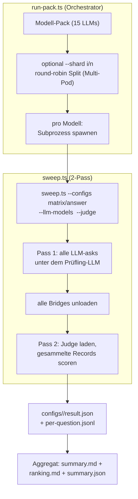

# Eval-Matrix

Dieses Kapitel beschreibt die Eval-Säule des Projekts: warum es eine Matrix-Auswertung gibt, aus welchen Achsen sie besteht, welche Metriken erhoben werden, wie der Judge funktioniert, und — ehrlich — was die Matrix leistet und was nicht. Stand: die **Code-Säule (Phase 1) ist fertig**, der **eigentliche GPU-Sweep (Phase 2) ist offen**.

Alle Pfade sind repo-relativ (`tests/evals/...`).

> WARN zu verifizieren — Die hier beschriebene Matrix-Eval (`tests/evals/answer/matrix-manifest.ts`, `embedder-pack.json`/`reranker-pack.json`, License-Gate `validate-model-licenses.ts`, `buildMatrixManifest`) liegt auf dem Branch `dom/ap-e2-matrix-eval` und ist **noch nicht nach `main` gemergt**. Auf `main` realisiert nur `matrixConfigs()` (`tests/evals/pipeline/configs.ts`) eine reduzierte Baseline (1 Embedder, Reranker-Achse). Dieses Kapitel ist am **2026-06-16 gegen den Branch-Stand verifiziert und korrigiert** (Zellenzahl 360→**315**, Embedder 8→**7** — `e5-base` nicht ladbar, Configs 24→**21**); offen bleibt nur der **Merge-Stand** vor der gebundenen Abgabe.

---

## 17.1 Ziel der Eval-Matrix

Ein RAG-System hat viele austauschbare Bausteine: welcher Embedder, welcher Reranker, welche Chunk-Größe, welches Antwort-LLM. Jede Kombination kann auf einem konkreten Korpus anders abschneiden. Die Eval-Matrix beantwortet datengetrieben: **Welche Kombination liefert auf dem LAP-Korpus (Kapitel 15) die beste Antwortqualität bei vertretbarer Latenz?** — statt diese Wahl aus dem Bauch zu treffen.

Die Matrix ist ein **kartesisches Produkt** über die Achsen Embedder × Reranker × Chunker × Antwort-LLM, bewertet auf demselben Datensatz mit denselben Metriken, gegen denselben (vom Prüfling getrennten) Judge.

---

## 17.2 Achsen und Member

Die Achsen werden aus Pack-Dateien unter `tests/evals/answer/` gelesen und in `matrixConfigs()` (`tests/evals/pipeline/configs.ts`) zum kartesischen Produkt zusammengesetzt. Tabelle 17.1 listet die Achsen und ihre Member im aktuellen Repo-Stand auf.

**Tabelle 17.1:** Achsen der Eval-Matrix und ihre Member.

| Achse           | Member im Repo-Stand (2026-06-14)                                                                                                                                                                         | Quelle                                               |
| --------------- | --------------------------------------------------------------------------------------------------------------------------------------------------------------------------------------------------------- | ---------------------------------------------------- |
| **Embedder**    | 7: `bge-m3`, `e5-large`, `arctic-l-v2`, `qwen3-emb-0.6b`, `qwen3-emb-4b`, `granite-emb`, `nomic-v2` (`e5-base` entfernt — GGUF-Architektur „xlmr" von node-llama-cpp 3.18.1 nicht ladbar; Pack `…-osi-7`) | `embedder-pack.json`                                 |
| **Reranker**    | 2 + Skip: `bge-reranker-v2-m3`, `bge-reranker-base` (+ `SkipReranker` automatisch)                                                                                                                        | `reranker-pack.json`                                 |
| **Chunker**     | 1: `fixed-512-64`                                                                                                                                                                                         | `MATRIX_CHUNKER_SPECS` (`answer/matrix-manifest.ts`) |
| **Antwort-LLM** | 15: u. a. `qwen3.5-{2b,4b,9b,27b}`, `qwen3-{4b-instruct,8b,14b}`, `phi-4-{mini,14b}`, `granite-{3.3-8b,4.1-3b}`, `mistral-nemo-12b`, `ministral-3-14b`, `eurollm-9b`, `smollm3-3b`                        | `model-pack.json`                                    |

### Größenrechnung (`buildMatrixManifest`)

Der Manifest-Helfer (`answer/matrix-manifest.ts`) rechnet die Achsen so zusammen:

```text
Reranker-Achse   = rerankers + 1 (SkipReranker)        = 2 + 1 = 3
Retrieval-Configs = Embedder × Reranker-Achse × Chunker = 7 × 3 × 1 = 21
Zellen            = Retrieval-Configs × Antwort-LLMs    = 21 × 15   = 315
Läufe             = Zellen × Fragen (Antwort + Judge)   = 315 × 163 = 51 345
```

> ⚠ Status unklar — Die ursprüngliche Design-Skizze nannte **7 Embedder × 3 Reranker × 1 Chunker × 19 LLMs = 399 Zellen**. Der aktuelle Code-/Pack-Stand (`embedder-pack.json` = `…-osi-7`, gelesen von `matrixConfigs()`) ergibt **7 × 3 × 1 × 15 = 315 Zellen** (15 OSI-LLMs nach Lizenz-Gate, **7** Embedder — `e5-base` wegen nicht ladbarer GGUF-Architektur „xlmr" entfernt —, 2+Skip Reranker, 1 Chunker). Die Differenz zur Design-Skizze (399) erklärt sich durch das Lizenz-Gate (Kapitel 18, LLM-Klassen Llama/Gemma/Hermes entfernt) und den entfallenen `e5-base`-Embedder. Maßgeblich ist der Code-/Pack-Stand (**315**); die finale Zahl ist nach dem GPU-Sweep aus dem geschriebenen `summary.json` zu bestätigen.

**Belegte Klarstellung zur „72":** Der Kommentar in `matrixConfigs()` (`configs.ts`, Z. 283) spricht von „8 embedder × (1 skip + 2 reranker) × 3 chunker = 72 configs". Real sind es **21 Retrieval-Configs**: Das `embedder-pack.json` enthält **7** Embedder (nicht 8 — `e5-base` entfernt), und die Chunker-Achse `MATRIX_CHUNKER_SPECS` (`answer/matrix-manifest.ts`) enthält **nur einen** Eintrag (`fixed-512-64`, nicht 3), also `7 × (2 + 1) × 1 = 21`. `sweep.ts` re-chunkt **nicht** pro Config (es nutzt die vor-gechunkten `dataset.chunks`); eine Mehr-Größen-Achse hier wäre wirkungslos (identische Ergebnisse). Der Chunk-Größen-Vergleich läuft korrekt als **separate Läufe** über die chunker-unabhängige Span-Metrik (siehe 17.4 und Kapitel 15.7). Der „72"-Kommentar im Quelltext ist somit **doppelt veraltet** (7 statt 8 Embedder, 1 statt 3 Chunker) und sollte auf 21 korrigiert werden. Die Gesamt-Zellenzahl ist entsprechend **315** (21 Retrieval-Configs × 15 Antwort-LLMs).

---

## 17.3 Judge

Der Judge bewertet die generierte Antwort. Standard-Muster: **LLM-as-Judge** (`tests/evals/judge/Judge.ts`, `LocalLlmJudge`). Tabelle 17.2 fasst die zentralen Eigenschaften des Judge zusammen.

**Tabelle 17.2:** Eigenschaften des LLM-as-Judge.

| Eigenschaft           | Wert                                                                                                                                                                   |
| --------------------- | ---------------------------------------------------------------------------------------------------------------------------------------------------------------------- |
| Judge-Modell          | **Mistral-Small-3.2-24B-Instruct** (`mistralai/Mistral-Small-3.2-24B-Instruct-2506`, Apache-2.0)                                                                       |
| Profil im Sweep       | gepinnt / über `--judge-path` bzw. Profil `xl`                                                                                                                         |
| Trennung vom Prüfling | **strikt**: das Antwort-LLM ist auf Profil `full` (Qwen3-8B) gepinnt, nie `auto` — sonst würde `auto` das XL-Judge-Modell als Prüfling mounten (Selbstbewertungs-Bias) |

Der Judge erhält pro Frage: die Frage, den/die Gold-Chunk-Text(e), die tatsächlich gefütterten Chunks und die generierte Antwort. Er bewertet drei Dimensionen auf 0–10 (intern auf 0–1 normalisiert):

- **correctness** — beantwortet die Antwort die Frage richtig (gegen Gold)? Bei `broad`/`summary`-Intent als **Coverage** umgedeutet (wie viele der erforderlichen Punkte abgedeckt).
- **groundedness** — stützt sich die Antwort auf die gelieferten Chunks oder halluziniert sie?
- **helpfulness** — verständlich, direkt, nicht zu lang?

Das Ausgabeformat ist streng (`correctness: <n>` / `groundedness: <n>` / `helpfulness: <n>` / `reason: …`) und wird per Zeilen-Regex robust geparst; ein einzelner Format-Aussetzer wird als `parsed: false` markiert und verzerrt den Mittelwert nicht. Der Judge-Prompt ist je nach `intent` ein Focused- oder ein Coverage-Prompt (`buildJudgePrompt`).

---

## 17.4 Metriken

Es gibt drei Metrik-Familien. Alle Retrieval-Metriken werden über die **reranked** Chunk-Liste gerechnet.

### Retrieval, chunk-id-basiert (`tests/evals/metrics.ts`)

Tabelle 17.3 erläutert die chunk-id-basierten Retrieval-Metriken.

**Tabelle 17.3:** Chunk-id-basierte Retrieval-Metriken.

| Metrik                         | Bedeutung                                                                        |
| ------------------------------ | -------------------------------------------------------------------------------- |
| `recall@1 / @5 / @10`          | Anteil der Fragen, bei denen der Gold-Chunk in den Top-k steht (single-relevant) |
| `recallRequired@5 / @10 / @12` | mittlere Abdeckung des `requiredChunkIds`-Sets in Top-k (multi-relevant)         |
| `MRR`                          | Mean Reciprocal Rank des Gold-Chunks                                             |
| `nDCG@10`                      | normalized DCG; bei single-relevant ist Ideal-DCG konstant 1                     |

`recallRequired@k` reduziert sich exakt auf `recall@k`, wenn alle Fragen single-relevant sind — wichtig für `broad`/`summary`, wo ein einzelner Chunk nicht genügt.

### Retrieval, span-basiert / chunker-unabhängig (`tests/evals/metrics-span.ts`)

Tabelle 17.4 erläutert die span-basierten, chunker-unabhängigen Retrieval-Metriken.

**Tabelle 17.4:** Span-basierte Retrieval-Metriken.

| Metrik                     | Bedeutung                                                                                             |
| -------------------------- | ----------------------------------------------------------------------------------------------------- |
| `recall@5 span / @10 span` | Treffer, wenn ein retrievter Chunk-Span einen Gold-Span **überlappt** (statt exaktem `chunkId`-Match) |
| `MRR span`                 | reziproker Rang des ersten überlappenden Spans                                                        |
| `nDCG@10 span`             | span-basiertes nDCG                                                                                   |

Der Span-Treffer nutzt halb-offene Intervall-Überlappung im **selben** Dokument (`spansOverlap`). Das ist die Voraussetzung dafür, dass **dieselbe** Gold-Wahrheit gegen **jede** Chunk-Größe bewertbar ist — die Chunker-Achse läuft als separate Datasets, vergleichbar nur über diese span-Metrik. Hinweis: in der `summary.md`-Tabelle erscheinen nur `r@5 span` + `MRR span` als Schnellblick; die vollen Span-Werte (`recall@10 span`, `nDCG@10 span`) stehen in `configs/<name>/result.json` (Kommentar in `sweep.ts`).

### Antwortqualität (Judge) + Latenz/Ressourcen

Tabelle 17.5 listet die Metriken für Antwortqualität, Latenz und Ressourcen samt ihrer Quelle.

**Tabelle 17.5:** Metriken für Antwortqualität, Latenz und Ressourcen.

| Metrik                                                      | Quelle                                                                                |
| ----------------------------------------------------------- | ------------------------------------------------------------------------------------- |
| `correctness / groundedness / helpfulness` + Mittel `score` | Judge (17.3)                                                                          |
| `composite`                                                 | `judge*2 + recall@5 − ttft_sec*0.5` (`compositeScore` in `Judge.ts`) — höher = besser |
| `TTFT` (p50/p95), `fullResponse`                            | `PhasedTimer` (`tests/evals/perf.ts`)                                                 |
| `RSS` (max/mean), `CPU-Load`, `freeVRAM` (min)              | `ResourceSampler`, 250 ms-Intervall                                                   |

Der `composite`-Score ist die Ranking-Größe: Qualität (Judge ×2, Recall ×1) gegen Latenz (TTFT-Penalty linear in Sekunden). Fehlt der Judge (Pass 1), fällt `composite` auf Recall-/TTFT zurück.

---

## 17.5 2-Pass-Sweep und Orchestrierung

Abbildung 17.1 zeigt den Ablauf von Orchestrator, 2-Pass-Sweep und Aggregation.



**Abbildung 17.1:** Ablauf von Orchestrator und 2-Pass-Sweep.

**Warum 2-Pass?** Prüfling-LLM (~5 GB) und Judge-LLM (Mistral-Small-3.2-24B, deutlich größer) sind so **nie gleichzeitig resident** — auf einer 32-GB-Maschine bleibt das System responsiv. Erst alle Antworten unter dem Prüfling generieren, dann sämtliche Bridges entladen, dann den Judge laden und die in-memory gesammelten Records bewerten (`sweep.ts`).

**Subprozess-pro-Modell + Resume** (`run-pack.ts`): der in-process Pack-Modus crashte nach 4–5 Modellen mit `ACCESS_VIOLATION` (node-llama-cpp leakt State über Load/Unload-Zyklen). Lösung: jedes Modell läuft in einem eigenen Kindprozess (`pnpm exec tsx tests/evals/sweep.ts …`). Crasht ein Modell, läuft der Rest weiter. **Resume-fähig** über einen `.done-<label>`-Marker pro Modell — ein erneuter Lauf überspringt fertige Modelle.

**Shard-Split für Multi-Pod** (`parseShard`/`selectShard`, `matrix-manifest.ts`): `--shard i/n` weist Pod `i` jedes `n`-te Modell zu (round-robin, disjunkt, Vereinigung = ganzes Pack). So lässt sich der Sweep über mehrere GPU-Pods (RunPod) parallelisieren.

**Pre-Run-Manifest** (`--summary`): `buildMatrixManifest` druckt vor dem Lauf eine Zusammenfassung (Achsen, Zellen, geschätzte GPU-Stunden) nach `matrix-manifest.md`, damit die Laufgröße vor dem teuren Sweep sichtbar ist.

---

## 17.6 Warum die Matrix sinnvoll ist — und warum sie keine absolute Wahrheit liefert

**Sinnvoll, weil:**

- Sie ersetzt Bauchentscheidungen über austauschbare Bausteine durch reproduzierbare Messung auf einem realen Korpus.
- Sie misst Retrieval (chunk- **und** span-basiert), Antwortqualität (Judge, drei Dimensionen) und Kosten (TTFT, RSS, VRAM) in **einem** Lauf.
- Lizenz-Disziplin (Kapitel 18) ist eingebaut: nur OSI-permissive Modelle in der Default-Matrix.

**Keine absolute Wahrheit, weil:**

- **Judge-Bias.** Ein LLM-Judge ist selbst fehlbar; er bevorzugt tendenziell bestimmte Stile. Die strikte Trennung Prüfling≠Judge mindert Selbstbewertungs-Bias, beseitigt aber nicht den generellen Judge-Bias. `parsedFraction` zeigt, wie verlässlich der Judge das Format einhielt.
- **Dataset-Grenzen.** Das LAP-Korpus (~90 Docs, überwiegend DE) ist endlich und themenspezifisch; Ergebnisse generalisieren nicht zwangsläufig auf andere Korpora/Sprachen.
- **Eval-Chunker ≠ Produktiv-Chunker.** Die Matrix misst auf `fixed-512-64`, die App nutzt einen section-aware Chunker (Kapitel 15.7). Die Zahlen bilden die App-Erfahrung nicht 1:1 ab.
- **Quantisierung.** Alle Modelle laufen als Q4_K_M/Q8_0-GGUF — die Q4-Quantisierung kann Modelle unterschiedlich stark treffen.

---

## 17.7 Aktueller Stand und nächste Schritte

Tabelle 17.6 gibt den Phasenstand der Eval-Säule wieder.

**Tabelle 17.6:** Phasenstand der Eval-Säule.

| Phase     | Inhalt                                                                                                                 | Status     |
| --------- | ---------------------------------------------------------------------------------------------------------------------- | ---------- |
| Phase 1   | Code: Achsen aus Packs, Metriken (chunk + span + Judge), 2-Pass-Sweep, run-pack-Orchestrator, Shard-Split, Lizenz-Gate | **fertig** |
| Phase 2   | eigentlicher GPU-Sweep über die volle Matrix (RunPod)                                                                  | **offen**  |
| Phase 3–5 | LAP-Doku, Auswertung/Interpretation, Aufnahme ins Abgabe-Paper                                                         | **offen**  |

> ⚠ Status unklar — Der vollständige GPU-Matrix-Sweep (Phase 2) ist zum Stand 2026-06-14 **noch nicht** durchgeführt. Es existiert ein früher Teil-Run (`tests/evals/report/runs/2026-06-06T18-08-58_af20084/`, nur die `matrix_*norr/bge-rr`-Retrieval-Configs), aber keine vollständige 315-Zellen-Auswertung mit Judge. Endgültige Zahlen liegen erst nach dem GPU-Sweep vor.

**Nötige Smoke-Tests vor dem großen Lauf:**

- `--limit N` (cappt Fragen pro Config) und `--no-llm` (retrieval-only) für einen schnellen Funktionscheck ohne große Modelle.
- `--configs default` mit Fake-Embedder/Noop-Reranker (`defaultConfigs()`) als reiner Pipeline-Smoke.
- `run-pack.ts --summary` für das Pre-Run-Manifest (Zellen + geschätzte GPU-Stunden).
- Lizenz-Gate `evals:licenses:check` (Kapitel 18) muss grün sein, bevor ein Modell in die Default-Matrix darf.

**Wie Ergebnisse später zu lesen sind:**

- `ranking.md` — Configs/Modelle nach `composite` sortiert (schneller „welche ist die beste"-Blick).
- `summary.md` — volle Tabelle inkl. `r@5`, `r@10`, `r@5 span`, `MRR span`, Judge, TTFT p50/p95, RSS, VRAM, `composite`.
- `configs/<name>/result.json` — die vollständigen Span-Werte (`recall@10 span`, `nDCG@10 span`) und Roh-Aggregate je Config.
- `configs/<name>/per-question.jsonl` — pro Frage: retrievte/reranked Chunk-IDs, Phasen-Timings, Judge-Score + `reason` (für die Fehleranalyse einzelner Cases).

**Ergebnis-Tabelle (Phase 2 — auszufüllen nach dem Sweep).** Tabelle 17.7 ist die **zentrale Ablage** für die gemessenen Endwerte. Sie wird nach dem GPU-Sweep aus `summary.json`/`ranking.md` befüllt (ein Edit je Zelle); die Zielerreichung in Kapitel 5 (Tabelle 5.5) und der Status in Kapitel 24 verweisen auf diese Tabelle, statt die Werte mehrfach zu pflegen.

> WARN durch GPU-Sweep (AP-E.2 Phase 2) zu ergaenzen — Werte aus `summary.json`/`ranking.md`

**Tabelle 17.7:** Ergebnis-Kennzahlen der Matrix-Eval (Phase 2 — ausstehend).

| Kennzahl                                                | Quelle                         | Ziel/Schwelle                        | Gemessen     |
| ------------------------------------------------------- | ------------------------------ | ------------------------------------ | ------------ |
| Beste Gesamt-Config (Embedder × Reranker × Antwort-LLM) | `ranking.md` (Top-`composite`) | —                                    | _ausstehend_ |
| Recall@5 (chunk-id, beste Config)                       | `summary.json` `r@5`           | Z-2 ≥ 0,70                           | _ausstehend_ |
| Span-Recall@5 (chunker-unabhängig)                      | `r@5 span`                     | Z-2-Variante (Gold-Span-Überlappung) | _ausstehend_ |
| nDCG@10 span / MRR span                                 | `configs/<name>/result.json`   | —                                    | _ausstehend_ |
| Judge: correctness / groundedness / helpfulness (⌀)     | Judge (17.3)                   | groundedness ≈ Faithfulness (Z-4)    | _ausstehend_ |
| composite (Sieger-Config)                               | `compositeScore`               | —                                    | _ausstehend_ |
| TTFT p50 / p95                                          | `PhasedTimer` (`perf.ts`)      | Latenz (Kapitel 20)                  | _ausstehend_ |
| Bestätigte Matrix-Größe (Zellen)                        | `summary.json`                 | 315 (Soll, Code-/Pack-Stand)         | _ausstehend_ |

Hinweis zur Zuordnung der Projektziele: Die **Refusal Rate** (Z-4, ≥ 95 % bzw. Abnahme ≥ 75 %) ist aus dem Refusal-Teilset der 163 Fragen (15 Fragen mit `expectedRefusal`) abzuleiten; die **Citation Accuracy** (Z-3, ≥ 85 %) stammt aus dem AP-E.1-Dev-Set-Eval (Kapitel 19), **nicht** aus dieser Matrix, und wird dort separat geführt.

---

_Querverweise: Datensatz/Gold-Spans → Kapitel 15; gemessene Pipeline → Kapitel 16; Modell-Lizenzen + Lizenz-Gate → Kapitel 18._
