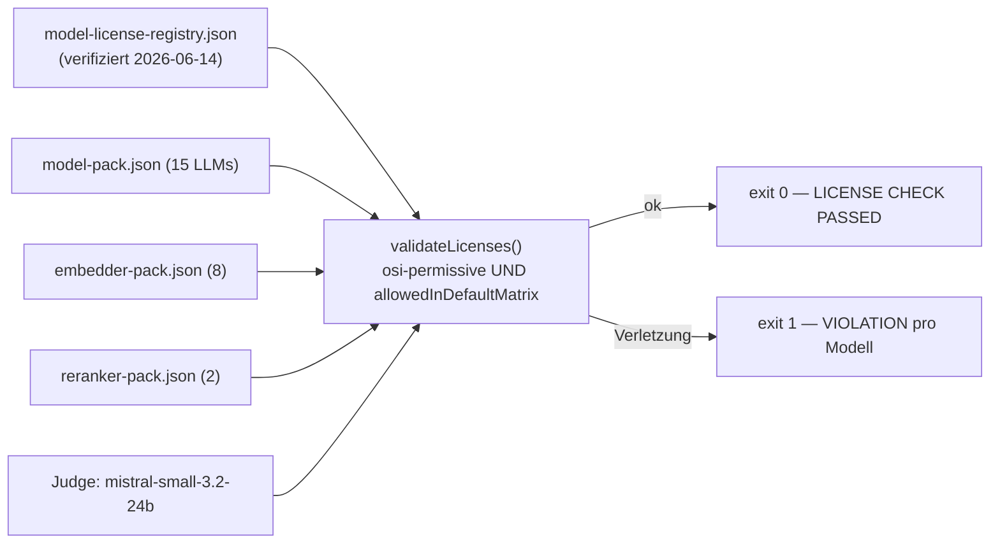

# 18 — Modellauswahl und Open-Source-Lizenzen

Dieses Kapitel dokumentiert, **welche** Modelle in welcher Rolle eingesetzt werden, **warum** die Standard-Matrix (Kapitel 17) ausschließlich OSI-permissive Modelle enthält, und **wie** diese Disziplin maschinell durchgesetzt wird (License-Registry + License-Gate). Es ist die juristisch-organisatorische Klammer um die KI-Säule.

Grundregel des Kapitels: **keine Lizenzbehauptung ohne Quelle.** Jede Aussage stützt sich auf die geprüfte License-Registry (`tests/evals/model-license-registry.json`, `verifiedAt: 2026-06-14`); unklare Fälle sind als „unknown / zu prüfen" markiert.

---

## 18.1 Modellrollen

| Rolle | Aufgabe | Standard (App) |
| --- | --- | --- |
| **Embedder** | Query/Chunk → Vektor (dense Retrieval) | BGE-M3 (`bge-m3`, MIT) |
| **Reranker** | Cross-Encoder, Präzisions-Pass über Kandidaten | BGE-Reranker-v2-M3 (Apache-2.0) |
| **Antwort-LLM** | Antwortgenerierung + Self-Refusal | Qwen3.5 Lite/Full/XL (Apache-2.0) |
| **Judge** (nur Eval) | bewertet generierte Antworten (LLM-as-Judge) | Mistral-Small-3.2-24B (Apache-2.0) |

Der Judge ist **kein** App-Bestandteil — er existiert nur in der Eval-Säule (Kapitel 17) und ist dort strikt vom Prüfling getrennt.

---

## 18.2 Lizenz-Klassen — was „offen" konkret bedeutet

Der Begriff „Open Source" wird bei KI-Modellen oft unsauber verwendet. Das Projekt unterscheidet bewusst:

| Begriff | Bedeutung | Beispiel |
| --- | --- | --- |
| **Open Source (OSI)** | OSI-anerkannte Lizenz; freie kommerzielle Nutzung, Weitergabe, Derivate — nur Attribution | Apache-2.0, MIT, BSD |
| **Open Weights** | Gewichte frei herunterladbar, aber **eigene** Nutzungsbedingungen statt OSI-Lizenz | — |
| **Source Available** | Code/Gewichte einsehbar, Nutzung eingeschränkt | — |
| **Custom License** | herstellereigene Bedingungen (Akzeptanz-Pflicht, Acceptable-Use-Policy, MAU-Cap) | Llama Community License, Gemma Terms of Use |

Der für das Projekt entscheidende Unterschied liegt **nicht** an der Frage „kommerziell erlaubt?" (das erlauben auch Gemma/Llama meist), sondern an der Frage **„OSI-permissiv, ohne nachgelagerte Pflichten und Nutzungs-Restriktionen?"**. Custom-Lizenzen erzwingen typischerweise:

- verpflichtende Lizenz-Akzeptanz vor dem Download (gated),
- eine **Prohibited-Use-/Acceptable-Use-Policy**, die downstream weitergereicht werden muss,
- bei Meta zusätzlich einen **MAU-Cap** (>700 Mio. monatlich aktive Nutzer → Sondergenehmigung nötig) und Namens-/Attributionspflichten.

Solche Klauseln sind in einer Lehr-/Abgabe-Software ein Compliance-Risiko und disqualifizieren ein Modell aus der Default-Matrix — selbst wenn das Modellkarten-YAML formal „apache-2.0" deklariert (siehe Gemma-4 unten).

---

## 18.3 Lizenzanforderung der Standard-Matrix

Die Default-Matrix lässt **nur** Modelle zu, die **beide** Bedingungen erfüllen (`validate-model-licenses.ts`):

1. `licenseClass === "osi-permissive"` (Apache-2.0 / MIT / BSD), **und**
2. `allowedInDefaultMatrix === true`.

Jede Verletzung führt zu `ok=false` — **keine stillen Fallbacks**. Das Gate prüft zusätzlich, dass die Registry-Rolle zur Pack-Rolle passt und dass keine Label-Dubletten über die Packs existieren.

Wichtig: `allowedInDefaultMatrix` kann auch bei OSI-permissiver Lizenz `false` sein — nämlich dann, wenn die Lizenz zwar permissiv ist, das Modell aber **technisch** nicht nutzbar ist (z. B. kein lauffähiges GGUF, oder llama.cpp-Reranking für die Architektur defekt). Beispiele in der Registry: `cand-gte-base` (encoder-only, von llama.cpp nicht konvertierbar), `cand-mxbai-rerank` (mainline-llama.cpp-rankAll broken). Lizenz **und** Lauffähigkeit müssen stimmen.

---

## 18.4 Ausgeschlossene Klassen

Folgende Modelle/Klassen sind aus der Default-Matrix **ausgeschlossen** (`allowedInDefaultMatrix: false`), mit der jeweiligen Begründung aus der Registry:

| Modell | `declaredLicense` | `licenseClass` | Ausschlussgrund |
| --- | --- | --- | --- |
| `llama-3.2-3b` | `llama3.2` | open-weight-non-osi | Llama 3.2 Community License: Attribution-/Namenspflicht, >700M-MAU-Cap, Acceptable-Use-Policy |
| `hermes-3-8b` | `llama3` | open-weight-non-osi | Llama-3.1-Finetune → Basis-Lizenz greift (nicht OSI) |
| `gemma-3-4b` | `gemma` | open-weight-non-osi | Gemma Terms of Use (custom Google), gated, Prohibited-Use-Policy |
| `gemma-4-e4b` | `apache-2.0` (deklariert) | open-weight-non-osi | YAML sagt apache-2.0, **aber** verpflichtender `license_link` ergänzt Apache um bindende Gemma-Terms + Prohibited-Use-Policy → **kein** OSI-konformes Apache-2.0 |
| `embeddinggemma` | `gemma` | open-weight-non-osi | Gemma Terms of Use (Embedder) |
| `jina-reranker-v2` | `cc-by-nc-4.0` | non-commercial | research/eval-only, kommerzielle Nutzung nur über Jina-Hosted-API |

Zusätzlich technisch (nicht lizenzbedingt) ausgeschlossen: `cand-gte-base` und `cand-mxbai-rerank` (siehe 18.3).

Der Fall **`gemma-4-e4b`** ist der lehrreichste: er zeigt, warum das Projekt **nicht** dem deklarierten YAML-Tag allein vertraut. Die Registry-Note hält fest, dass ein verpflichtender Lizenz-Link Apache-2.0 mit nicht-Apache-Pflichten überlagert — dieselbe Hybrid-Konstruktion über alle Gemma-Generationen. Konsequenz: trotz „apache-2.0"-Tag ist es `open-weight-non-osi` und ausgeschlossen.

---

## 18.5 License-Registry und License-Gate

### Registry (`tests/evals/model-license-registry.json`)

Die Registry ist die **einzige Quelle der Wahrheit** für Modell-Lizenzen. Jeder Eintrag trägt: `label`, `role`, `repo`, `declaredLicense`, `licenseUrl` (geprüfte Quelle), `licenseClass`, `allowedInDefaultMatrix`, `inDefaultPack`, eine ausführliche `notes`-Begründung und `verifiedAt`. Kopf: `verifiedAt: "2026-06-14"`.

Die `notes` sind bewusst detailliert — sie dokumentieren **wo** die Lizenz geprüft wurde (Model-Card-YAML, LICENSE-Datei im Repo, HF-API, Upstream-GitHub) und ob die Quellen übereinstimmen. Wo keine separate `LICENSE`-Datei existiert (häufig bei HF-Modellen), ist das Modellkarten-Metadaten-Tag als autoritativ vermerkt.

### Gate (`tests/evals/license/validate-model-licenses.ts`)

Das Gate liest die Registry plus die drei Pack-Dateien (`model-pack.json`, `embedder-pack.json`, `reranker-pack.json`) und den Judge (`mistral-small-3.2-24b`), prüft jeden Pack-Eintrag gegen die Registry und gibt eine Tabelle + Exit-Code aus:

Verletzungsgründe, die das Gate ausgibt: „NOT in license registry", „registry role != pack role", „licenseClass … is not osi-permissive", „allowedInDefaultMatrix=false", sowie Label-Dubletten über Packs. Damit ist sichergestellt, dass **kein** nicht-permissives Modell unbemerkt in einen Default-Matrix-Lauf gerät.

### Default-Pack — die zugelassenen Modelle

Im OSI-Default-Pack (`model-pack.json`, `inDefaultPack: true`) sind die 15 Antwort-LLMs alle Apache-2.0 oder MIT:

| Lizenz | Antwort-LLMs |
| --- | --- |
| Apache-2.0 | `qwen3-4b-instruct`, `qwen3-8b`, `qwen3-14b`, `qwen3.5-{2b,4b,9b,27b}`, `granite-{3.3-8b,4.1-3b}`, `mistral-nemo-12b`, `ministral-3-14b`, `eurollm-9b`, `smollm3-3b` |
| MIT | `phi-4-mini`, `phi-4-14b` |

Embedder (alle OSI): `bge-m3` (MIT), `e5-base`/`e5-large` (MIT), `arctic-l-v2`, `qwen3-emb-0.6b`/`qwen3-emb-4b`, `granite-emb`, `nomic-v2` (Apache-2.0). Reranker: `bge-reranker-v2-m3` (Apache-2.0), `bge-reranker-base` (MIT). Judge: `mistral-small-3.2-24b` (Apache-2.0).

---

## 18.6 Offene Lizenzprüfungen und Caveats

Auch innerhalb der OSI-Modelle hält die Registry technische Vorbehalte fest, die vor produktivem Einsatz zu beachten sind:

- **`bge-reranker-base`** (MIT) — BERT-basiert (BertForSequenceClassification); mainline-llama.cpp `rankAll` ist offiziell nur gegen XLMRoberta-basierte Reranker (v2-m3) getestet. Vanilla-BERT-Cross-Encoder-Support ist **nicht bestätigt** → mit Vorsicht nutzen, `v2-m3` bevorzugen.
- **`mistral-nemo-12b` / `eurollm-9b` / `bge-m3` u. a.** — keine separate `LICENSE`-Datei im HF-Repo (404); das Metadaten-Tag (+ offizielle Ankündigung) ist autoritativ. Registry vermerkt das pro Eintrag.
- **`cand-gte-reranker`** (Apache-2.0) — GGUF nur über `gpustack/llama-box`-Fork lauffähig, nicht bestätigt für mainline-llama.cpp `rankAll` → `inDefaultPack: false`.

> ⚠ zu verifizieren — Die Registry ist auf den Stand `2026-06-14` datiert. Modell-Lizenzen können sich bei neuen Releases ändern (z. B. wechselte Gemma 4 nominell zu Apache, behielt aber die Gemma-Terms-Überlagerung). Vor jedem neuen Sweep bzw. vor der Abgabe ist die Registry erneut gegen die `licenseUrl`-Quellen zu prüfen und `verifiedAt` zu aktualisieren.

---

## 18.7 Risiken durch Modelllizenzen

| Risiko | Wirkung | Gegenmaßnahme |
| --- | --- | --- |
| **YAML-Tag ≠ tatsächliche Lizenz** | „apache-2.0"-Tag mit überlagernden Custom-Terms (Gemma-4) gerät unbemerkt in die Matrix | Registry prüft den **verpflichtenden Lizenz-Link**, nicht nur das Tag; Gate erzwingt `licenseClass` |
| **Basis-Modell-Lizenz vererbt** | Finetune eines Llama/Gemma-Basismodells erbt dessen Restriktionen (Hermes-3) | Registry-Note dokumentiert Basis-Lizenz pro Finetune |
| **Non-commercial schleicht ein** | CC-BY-NC-Modell (jina-reranker-v2) in Produktiv-/Abgabe-Software | `licenseClass: non-commercial` → Gate blockt |
| **Lizenz-Drift bei Updates** | spätere Modell-Version ändert Lizenz | `verifiedAt` + Pflicht zur Re-Prüfung vor Abgabe |
| **Technisch unbrauchbar trotz OSI** | permissive Lizenz, aber kein lauffähiges GGUF | `allowedInDefaultMatrix: false` trennt Lizenz von Lauffähigkeit |
| **Quellen widersprechen sich** | YAML vs. LICENSE-Datei uneinig | Registry-Note hält Übereinstimmung/Diskrepanz explizit fest |

---

## 18.8 Abgrenzung zu den App-Dependencies

Dieses Kapitel betrifft **KI-Modell-Lizenzen** (GGUF-Gewichte). Die Lizenzen der **Software-Abhängigkeiten** (npm/Electron/React/PGlite/Drizzle …) sind separat in `docs/licenses.md` geführt — dort sind alle direkten Produktions- und Dev-Dependencies mit Version, Lizenz und Copyright-Inhaber gelistet (überwiegend MIT/Apache-2.0/BSD, keine Copyleft-Dependency in der Distribution). Das eigene Projekt steht unter **MIT** (`LICENSE`).

---

*Querverweise: Modellrollen im Datenfluss → Kapitel 16; Eval-Matrix-Achsen, die diese Modelle nutzen → Kapitel 17; Software-Dependency-Lizenzen → `docs/licenses.md`.*
