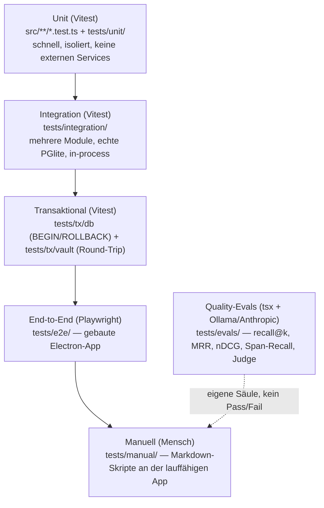
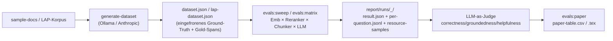

# Testing und Qualitätssicherung

Stand: **2026-06-14**. Test-Owner: **Dominik Furlan** (Dokumentation & Tests, UI/UX). Denys Tudosa (Projekt-Owner: Chunking/Auth/RAG/Installer) ergänzt punktuell Co-Located-Unit-Tests zu dem Code, den er selbst implementiert.

Quellen für dieses Kapitel: `tests/README.md`, `tests/manual/README.md`, `tests/manual/m-szenarien/README.md`, `tests/evals/README.md`, `tests/e2e/README.md`, `.github/workflows/checks.yml`, `docs/work/ap-t1-abschluss-doku.md`, `docs/work/ap-t2-abschluss-doku.md`, `docs/work/ap-e1-abschluss-doku.md`, `docs/work/laborberichte/Laborbericht_LokLM_2026-06-12.md`.

> Die Abschluss-Dokus und Laborberichte unter `docs/work/` sind gitignored (interne Arbeitsstände, nicht Teil des öffentlichen Repos). Sie sind hier als Beleg zitiert, weil sie die einzige Quelle für die exakten Coverage-Zahlen sind.

---

## 19.1 Teststrategie und Pflichtenheft-Bezug

LokLM folgt einer fünfstufigen Testpyramide plus einer separaten Eval-Säule. Die Ebenen decken §8 (Testkonzept) des Pflichtenhefts ab (Quelle: `tests/README.md`). Tabelle 19.1 ordnet die Pflichtenheft-Punkte den Testebenen und Ordnern zu.

**Tabelle 19.1:** Pflichtenheft-Punkte und Testebenen.

| Pflichtenheft                | Ebene                       | Ordner / Konvention                                     |
| ---------------------------- | --------------------------- | ------------------------------------------------------- |
| §8.1 Unit-Tests              | Unit                        | `src/**/*.test.ts(x)` (co-located) + `tests/unit/`      |
| §8.2 Integrationstests       | Integration + Transaktional | `tests/integration/`, `tests/tx/db/`, `tests/tx/vault/` |
| §8.3 Manuelle Test-Szenarien | Manuell                     | `tests/manual/`                                         |
| §8.4 Abnahme-/Systemtests    | End-to-End                  | `tests/e2e/` (Playwright)                               |
| §8.5 Eval-Set / RAG-Qualität | Quality-Evals               | `tests/evals/`                                          |

Leitprinzip (aus `tests/README.md`): „von schnell und isoliert nach langsam und realistisch". Redundanz quer durch die Pyramide ist **gewollt** — derselbe Bereich (z. B. `AuthService`) wird auf mehreren Ebenen berührt; Vollständigkeit pro Ebene ist nicht das Ziel.

Abbildung 19.1 zeigt die Testpyramide und die separate Eval-Säule.

**Abbildung 19.1:** Testpyramide und Eval-Säule.

---

## 19.2 Automatisierte Tests (Vitest)

### 19.2.1 Unit-Tests (§8.1)

Die automatisierten Unit-, Integrations- und Transaktionstests laufen unter Vitest [11]. Unit-Tests liegen teils **co-located** neben dem Modul (`Foo.ts` → `Foo.test.ts`, z. B. `src/shared/citationMarkers.test.ts`) und teils unter `tests/unit/` (56 Dateien zum Stichtag, u. a. `chunker.test.ts`, `parser.test.ts`, `rrf.test.ts`, `eval-metrics.test.ts`, `license-validator.test.ts`, `matrix-manifest.test.ts`). Sie laufen ohne externe Services: PGlite [3] in-process, Argon2 nativ/lokal, OCR gemockt, keine Netzwerkzugriffe.

### 19.2.2 Integrationstests (§8.2)

`tests/integration/` zieht mehrere Module in-Process zusammen, gegen eine **echte In-Memory-PGlite** (inkl. pgvector [4], Drizzle [5]- + Raw-SQL-Migrationen), gestartet über `AuthService.register` — keine Mocks. Die drei §8.2-E2E-Suiten (AP-T.2) sind in Tabelle 19.2 zusammengefasst.

**Tabelle 19.2:** Integrations-E2E-Suiten (AP-T.2).

| Suite                | Datei                                            | Inhalt                                                                                                        |
| -------------------- | ------------------------------------------------ | ------------------------------------------------------------------------------------------------------------- |
| DocumentService E2E  | `tests/integration/document-pdf-e2e.test.ts`     | Committetes `sample.pdf` → `documents` auf `ready`, Chunks, `idx_chunks_fts`, `chunk_count` (INSERT + DELETE) |
| RetrievalService E2E | `tests/integration/retrieval-corpus-e2e.test.ts` | 60-Chunk-Korpus, 10 Fragen treffen ihre `##`-Sektion im Top-5, In-Prozess-Determinismus                       |
| Auth E2E §8.2        | `tests/integration/auth-e2e.test.ts`             | Voller Round-Trip: Register → Login → Verschlüsseln → Neustart → Entschlüsseln → Recovery-Reset → neuer Login |

### 19.2.3 Transaktionstests (§8.2)

Tabelle 19.3 listet die transaktionalen Testebenen und ihre Isolation.

**Tabelle 19.3:** Transaktionale Testebenen und Isolation.

| Ebene               | Ordner            | Isolation                                                                                                                   |
| ------------------- | ----------------- | --------------------------------------------------------------------------------------------------------------------------- |
| Transaktional DB    | `tests/tx/db/`    | `BEGIN/ROLLBACK` pro Test (u. a. `documents-repo`, `search-repo`, `embedding-repo`, `conversations-repo`, `schema-objects`) |
| Transaktional Vault | `tests/tx/vault/` | Voller Vault-Round-Trip register → dump → encrypt → load (`round-trip.test.ts`, `crash-resilience.test.ts`)                 |

### 19.2.4 Reproduktion und Laufzeit

- Voll-Suite (unit + int + tx): `pnpm test`. Coverage: `pnpm test:cov` (v8).
- AP-T.2-Suiten zusammen lokal ~70 s (< 5 min gefordert); CI-Job (integration + tx) ~2:40 min (Quelle: `ap-t2-abschluss-doku.md`).
- AP-T.1-Scoped-Lauf `pnpm run test:cov:apt1` (96 Tests, ~20 s).

---

## 19.3 Coverage AP-T.1 (§8.1, Branch ≥ 70 %, Statements ≥ 80 %)

Nachweis: `pnpm run test:cov:apt1` (Quelle: `docs/work/ap-t1-abschluss-doku.md`). Alle fünf Zielmodule erfüllen **beide** Schwellen, wie Tabelle 19.4 belegt.

**Tabelle 19.4:** Coverage der AP-T.1-Zielmodule.

| Modul                                   | Tests                                                            | % Statements (≥ 80) | % Branch (≥ 70) |
| --------------------------------------- | ---------------------------------------------------------------- | ------------------- | --------------- |
| `chunker.ts`                            | `tests/unit/chunker.test.ts`                                     | 95.41               | 93.84           |
| `parser.ts`                             | `tests/unit/parser.test.ts` + `parser-ocr.test.ts`               | 88.71               | 78.43           |
| RetrievalService RRF (`rrf.ts`)         | `tests/unit/rrf.test.ts`                                         | 100                 | 100             |
| Citation-Parser (`citationMarkers.ts`)  | `src/shared/citationMarkers.test.ts`                             | 96.29               | 88.88           |
| Auth-Hashing-Wrapper (`AuthService.ts`) | `tests/unit/auth-crypto.test.ts` + `auth-service-guards.test.ts` | 83.05               | 74.17           |

**Abweichung vom Ticket-Wortlaut, bewusst dokumentiert:** Das Ticket nennt einen „PBKDF2-Wrapper". Implementiert ist **Argon2id** [6] ([ADR-0001](23_decision_log.md)) — getestet werden die real implementierten Wrapper (Argon2id + AES-256-GCM [7]), nicht der nie existierende PBKDF2-Pfad. Der `AuthService`-Branch-Wert (74.17 %) erreicht die Schwelle erst kombiniert mit den Auth-Integrationstests; reine Wrapper-Unit-Tests heben die Datei nur auf ~67 % (Session-/Vault-Logik braucht den echten Tresor). Die DoD nennt `pnpm test --coverage` (Gesamtsuite), nicht „Unit allein".

> Der `export` der vier Krypto-Wrapper (`deriveKEK`/`wrapKey`/`unwrapKey`/`decryptBody`) ist rein test-getrieben (keine Logikänderung, nur Sichtbarkeit der Fehler-Branches). An Denys als Domänen-Owner gemeldet, nicht eigenmächtig in die Auth-Logik eingegriffen.

---

## 19.4 Manuelle Tests (§8.3)

Markdown-Anleitungen unter `tests/manual/`, Schritt für Schritt an einer gebauten/lauffähigen App abzuarbeiten — kein Script. Tabelle 19.5 listet die themenbezogenen Ordner.

**Tabelle 19.5:** Themenbezogene manuelle Testanleitungen.

| Bereich  | Datei(en)                                                                     |
| -------- | ----------------------------------------------------------------------------- |
| Auth     | `auth/01-registrierung.md`, `02-login-logout.md`, `03-recovery-code-reset.md` |
| Chat     | `chat/01-chat-mit-zitaten.md`                                                 |
| Library  | `library/01-suche-und-filter.md`                                              |
| Settings | `settings/01-ollama-connector.md`                                             |
| Hardware | `hardware/01-hardware-smoke-test.md`                                          |

M-Szenarien (§8.3, AP-T.3b) unter `tests/manual/m-szenarien/` sind in Tabelle 19.6 aufgeführt.

**Tabelle 19.6:** M-Szenarien und Durchführungsstatus.

| Nr. | Szenario                                                   | Status             |
| --- | ---------------------------------------------------------- | ------------------ |
| M3  | Markdown importieren, Frage auf Englisch (bilingual)       | Nicht durchgeführt |
| M4  | Quellcode-Datei importieren, technische Frage zur Codebase | Nicht durchgeführt |
| M8  | Workspace löschen → kaskadierendes Löschen aller Daten     | Nicht durchgeführt |
| M9  | App neu starten → Snapshot korrekt entschlüsselt           | Nicht durchgeführt |
| M10 | Modell-Datei umbenennen → Fallback-Synthese                | Nicht durchgeführt |
| M11 | 100+-Seiten-PDF → Indexierung + Performance                | Nicht durchgeführt |

**Trennung Anlegen ↔ Ausführen (bewusst):** Das _Anlegen_ der Szenario-Gerüste (AP-T.3b) ist erledigt; die Dateien tragen bewusst `Status: Nicht durchgeführt` — sie sind die Anleitung, nicht das Protokoll. Das _Ausführen + Protokollieren_ (AP-T.3) ist für Sprint 7 vorgesehen, mindestens vor jedem Release. M1, M2, M5–M7 sind in den themenbezogenen Ordnern (`auth/`, `chat/` …) verortet.

> WARN Status unklar — die M-Szenarien M3/M4/M8–M11 sind als Anleitung angelegt, aber noch nicht protokolliert durchgeführt. Vor der Abgabe sollte mindestens ein dokumentierter Durchlauf erfolgen.

---

## 19.5 Smoke-Tests

- **Hardware-Smoke-Test** (`tests/manual/hardware/01-hardware-smoke-test.md`): manueller Lauf auf unterschiedlicher Hardware (GPU/CPU-only), deckt OS-Spezifika und Modell-Residency ab, die in CI nicht reproduzierbar sind.
- **Eval-Smoke**: `pnpm evals:run` läuft mit Fake-Stub-Configs (`defaultConfigs()`, kein LLM-Load) als schneller CI-tauglicher Smoke; `pnpm evals:sweep -- --limit 10` als 10-Fragen-Smoke pro Config (Quelle: `tests/evals/README.md`).
- **Dist-Smoke** (Website): erst nach `pnpm build`, da der dist-Stand geprüft wird.

---

## 19.6 Eval-Tests (Quality-Evals, §8.5)

Eigene Säule neben der Pyramide (`tests/evals/`): es wird **nicht Korrektheit** geprüft (Pass/Fail), sondern **Qualität** einer probabilistischen Pipeline — Zahlen (recall@k, MRR, nDCG, Span-Recall) im Config-Vergleich. „Eine Eval schlägt nicht fehl — sie schneidet besser oder schlechter ab." (Quelle: `tests/evals/README.md`).

### 19.6.1 Eval-Dev-Set (AP-E.1)

`tests/evals/data/cases.jsonl` — **80 Fälle**: 24 DE / 56 EN (30/70), 48 beantwortbar / 20 Refusal / 12 teilweise (60/25/15), über fünf Sample-Docs. Schema je Fall: `id, lang, workspace_seed, question, expected_chunk_ids, expected_answer_substring, expected_refusal`. Validator/Loader `tests/unit/eval-cases.test.ts` (386 Tests) prüft Schema, Verteilung, eindeutige IDs, das **wörtliche** Vorkommen jedes Belegs im referenzierten Chunk und pinnt den Chunker `fixed-512-64`. Die 15 versiegelten Hold-out-Fälle (AP-E1b, R5-Echo-Kammer-Schutz) liegen separat als `tests/evals/data/holdout/dominik-15.jsonl` (Branch `dom/ap-e1b-holdout`, bewusst nicht gepusht).

### 19.6.2 Matrix-Eval (AP-E.2) — kartesischer RAG-Sweep

AP-E.2 evaluiert die RAG [26]-Pipeline als kartesisches Produkt über vier Achsen (Quellen: `tests/evals/README.md`, `tests/evals/answer/matrix-manifest.ts`, die Packs unter `tests/evals/answer/`). Tabelle 19.7 zeigt die vier Matrix-Achsen.

**Tabelle 19.7:** Achsen des kartesischen RAG-Sweeps.

| Achse       | Anzahl               | Pack / Quelle                                                                                                                                                 |
| ----------- | -------------------- | ------------------------------------------------------------------------------------------------------------------------------------------------------------- |
| Embedder    | 7                    | `embedder-pack.json` (`…-osi-7`: bge-m3, e5-large, arctic-l-v2, qwen3-emb-0.6b/4b, granite-emb, nomic-v2; `e5-base` entfernt — GGUF-Arch „xlmr" nicht ladbar) |
| Reranker    | 2 + SkipReranker = 3 | `reranker-pack.json` (bge-reranker-v2-m3, bge-reranker-base) + automatischer Skip                                                                             |
| Chunker     | 1 (`fixed-512-64`)   | `MATRIX_CHUNKER_SPECS` — Chunk-Größe wird als **separate Dataset-Läufe** verglichen, nicht in der Matrix (sweep re-chunkt nicht pro Config)                   |
| Antwort-LLM | 15                   | `model-pack.json` (`loklm-matrix-llms-osi-15`, nur OSI-permissiv)                                                                                             |

Daraus: Retrieval-Configs = 7 × 3 × 1 = **21**; Zellen = 21 × 15 = **315**; Läufe = 315 × 163 DE-Fragen (Antwort + Judge). Der Pre-Run-Manifest (`buildMatrixManifest`) schätzt daraus die GPU-Stunden.

> WARN Status unklar — die ursprüngliche Design-Größe lag bei ~399 Zellen; die committeten OSI-Packs ergeben **315 Zellen** (7 Embedder × 3 Reranker-Achse × 1 Chunker × 15 LLMs), nachdem non-OSI-Modelle (Llama/Gemma/Hermes, jina-reranker) und der nicht ladbare `e5-base`-Embedder ausgeschlossen wurden. Die exakte Zellenzahl des Abgabe-Laufs hängt vom final bestätigten Scope ab (offene Team-Entscheidung).

LAP-Dataset zum Stichtag: `lap-dataset.json` mit **2.322 Chunks**, **163 deutschen RAG-Fragen** (148 answerable + 15 refusal), verifizierten Gold-Spans (Quelle: `projektstatusbericht-2026-06-14.md`).

### 19.6.3 Span-Recall-Metrik (chunker-unabhängig)

`tests/evals/metrics-span.ts` (+ `tests/unit/eval-metrics-span.test.ts`, `chunker-spans.test.ts`) misst Retrieval über **Zeichen-Offset-Overlap** zwischen retrievten Chunks und Gold-Spans im Quelldokument — bewusst **chunker-unabhängig**, damit unterschiedliche Chunkings über dieselben Gold-Spans vergleichbar bleiben. Span-r@10 / nDCG liegen pro Lauf in `result.json` (nicht in der summary-Tabelle).

### 19.6.4 Judge und Paper-Aggregation

`pnpm evals:sweep -- --judge` lädt ein XL-Profil-Modell als Bewerter und scort jede Antwort entlang **correctness**, **groundedness**, **helpfulness**. Composite: `2 × judge.score + 1 × recall@5 − 0.5 × (TTFT_p50_ms / 1000)`. `evals:datasets` (Multi-Datensatz-Schleife) und `evals:paper` (`aggregate-paper.ts` → `paper-table.csv`/`.tex`) automatisieren den Weg zur papierfertigen Tabelle. Diese A/B/C-Schicht ist implementiert und unit-getestet (`matrix-configs.test.ts`, `matrix-manifest.test.ts`, `paper-aggregate.test.ts`).

Abbildung 19.2 zeigt die Eval-Pipeline von den Sample-Docs bis zur papierfertigen Tabelle.

**Abbildung 19.2:** Eval-Pipeline bis zur Paper-Tabelle.

---

## 19.7 Validatoren, Lizenz- und Datenchecks

Tabelle 19.8 fasst die Validatoren sowie Lizenz- und Datenchecks zusammen.

**Tabelle 19.8:** Validatoren, Lizenz- und Datenchecks.

| Check               | Datei                                                                                       | Wirkung                                                                                                                                                                                                                                                   |
| ------------------- | ------------------------------------------------------------------------------------------- | --------------------------------------------------------------------------------------------------------------------------------------------------------------------------------------------------------------------------------------------------------- |
| Eval-Case-Validator | `tests/unit/eval-cases.test.ts`                                                             | Schema, Verteilung, wörtliches Beleg-Vorkommen, Chunker-Pin, Hold-out-Dedup-Guard (386 Tests)                                                                                                                                                             |
| Lizenz-Validator    | `tests/evals/license/validate-model-licenses.ts` (+ `tests/unit/license-validator.test.ts`) | Default-Matrix erlaubt **nur** `licenseClass='osi-permissive'` UND `allowedInDefaultMatrix=true`; jede Verletzung → `ok=false`, keine stillen Fallbacks. Erkennt fehlende Registry-Einträge, Rollen-Mismatch, Duplikate, non-OSI-/non-commercial-Lizenzen |
| Lizenz-Registry     | `tests/evals/model-license-registry.json`                                                   | Pro Modell Quelle/`licenseUrl`, `licenseClass`, `allowedInDefaultMatrix`, verifiziert 2026-06-14                                                                                                                                                          |
| LAP-Dataset-Build   | `tests/unit/build-lap-dataset.test.ts`                                                      | Char-Offsets, Gold-Spans, Refusal-Erhalt beim Korpus-Converter                                                                                                                                                                                            |
| Span-Metriken       | `tests/unit/eval-metrics-span.test.ts`, `chunker-spans.test.ts`                             | Korrektheit der Span-Overlap-Berechnung                                                                                                                                                                                                                   |

Der Lizenz-Gate ist die Grundlage dafür, dass nur OSI-permissive Modelle (Apache-2.0/MIT/BSD) in die Default-Matrix gelangen — siehe [Decision Log](23_decision_log.md) und [Risiken](22_risks_problems_and_mitigations.md).

---

## 19.8 Continuous Integration (`.github/workflows/checks.yml`)

CI läuft auf PRs und auf jeden push außer `main` (`main` hat einen eigenen Deploy-Workflow). Tabelle 19.9 zeigt den ehrlichen Stand der CI-Jobs.

**Tabelle 19.9:** Continuous-Integration-Jobs und Status.

| Job                          | Was läuft                                                | Status                                                                                                                  |
| ---------------------------- | -------------------------------------------------------- | ----------------------------------------------------------------------------------------------------------------------- |
| **Website**                  | `astro check` + Build (`website/`, Node 24, pnpm)        | Im Repo, grün; war **lange der einzige** CI-Job                                                                         |
| **Tests (integration + tx)** | `pnpm test:integration` + `pnpm test:tx`, Timeout 15 min | Erster vitest-Job im Repo (AP-T.2); grün via schlankem Electron-Stub; seit Merge von **PR #19** (2026-06-16) auf `main` |

Seit dem Merge von **PR #19** (AP-T.2) am 2026-06-16 enthält `.github/workflows/checks.yml` auf `main` neben dem Website-Job auch den vitest-Job **Tests (integration + tx)** (`pnpm test:integration` + `pnpm test:tx`). Die AP-T.1-Coverage-Nachweise bleiben lokal über `pnpm run test:cov:apt1` reproduzierbar; ein dauerhaftes Coverage-Threshold-Gate ist als Folgeticket vermerkt (siehe Kapitel 24).

---

## 19.9 Bekannte Lücken (ehrlich)

Tabelle 19.10 dokumentiert die bekannten Lücken samt Beleg.

**Tabelle 19.10:** Bekannte Test- und CI-Lücken.

| Lücke                                            | Detail                                                                                                                                                                                                                                                                                                                   | Beleg                                                                                                               |
| ------------------------------------------------ | ------------------------------------------------------------------------------------------------------------------------------------------------------------------------------------------------------------------------------------------------------------------------------------------------------------------------ | ------------------------------------------------------------------------------------------------------------------- |
| **E2E-Playwright startet Electron auf CI nicht** | Der Playwright-`_electron`-Driver kann die gebaute Electron-App im CI-Runner nicht zuverlässig starten; die gesamte `tests/e2e/`-Suite ist auf CI **nicht lauffähig**. `launch.ts` startet `out/main/index.js` über `electron.launch` mit eigenem `--user-data-dir` — funktioniert nur an einer realen Desktop-Umgebung. | `tests/e2e/helpers/launch.ts`, `tests/e2e/playwright.config.ts`; Memory `e2e-harness-electron-playwright-broken.md` |
| **RetrievalService-E2E ist modell-gated**        | `retrieval-corpus-e2e.test.ts` läuft gegen das echte BGE-M3-GGUF (`describe.runIf`); das Modell liegt nicht im CI-Runner, daher **skippt** die Suite in CI. Lokal mit Modell grün.                                                                                                                                       | `ap-t2-abschluss-doku.md` §3, `Laborbericht_…2026-06-12.md` §4                                                      |
| **CI baute lange nur die Website**               | Der erste vitest-CI-Job (integration + tx) kam erst mit AP-T.2 (PR #19, Electron-Stub für grünen Ubuntu-Lauf). Davor gab es keinen automatisierten Test-Job im Repo.                                                                                                                                                     | `checks.yml`, `Laborbericht_…2026-06-12.md` §2.3                                                                    |
| **Kein dauerhaftes Coverage-Threshold-Gate**     | `vitest coverage.thresholds` ist (noch) nicht als Merge-Gate verdrahtet; der AP-T.1-Nachweis ist scoped (`test:cov:apt1`), bis PR #19 den Test-Job in `main` bringt.                                                                                                                                                     | `ap-t1-abschluss-doku.md` „Offene Fragen"                                                                           |
| **AP-E.2 Phase 2 (GPU-Sweep) offen**             | Metrik + LAP-Dataset (Phase 1) stehen; der eigentliche Multi-Pod-GPU-Sweep über die Matrix ist vor der Abgabe noch nicht gefahren; Teile der Matrix-Verdrahtung sind noch uncommittet.                                                                                                                                   | `projektstatusbericht-2026-06-14.md`                                                                                |

An die Logik-Domäne (Denys) gemeldet, nicht eigenmächtig geändert: `searchChunks`/`searchChunksByVector` ohne Tie-Break im `ORDER BY` (Cross-Session-Determinismus nicht garantiert) und ein fixes `setTimeout(2000)` in `document-import.test.ts` (latentes Flake-Risiko). Quelle: `ap-t2-abschluss-doku.md` §3.
