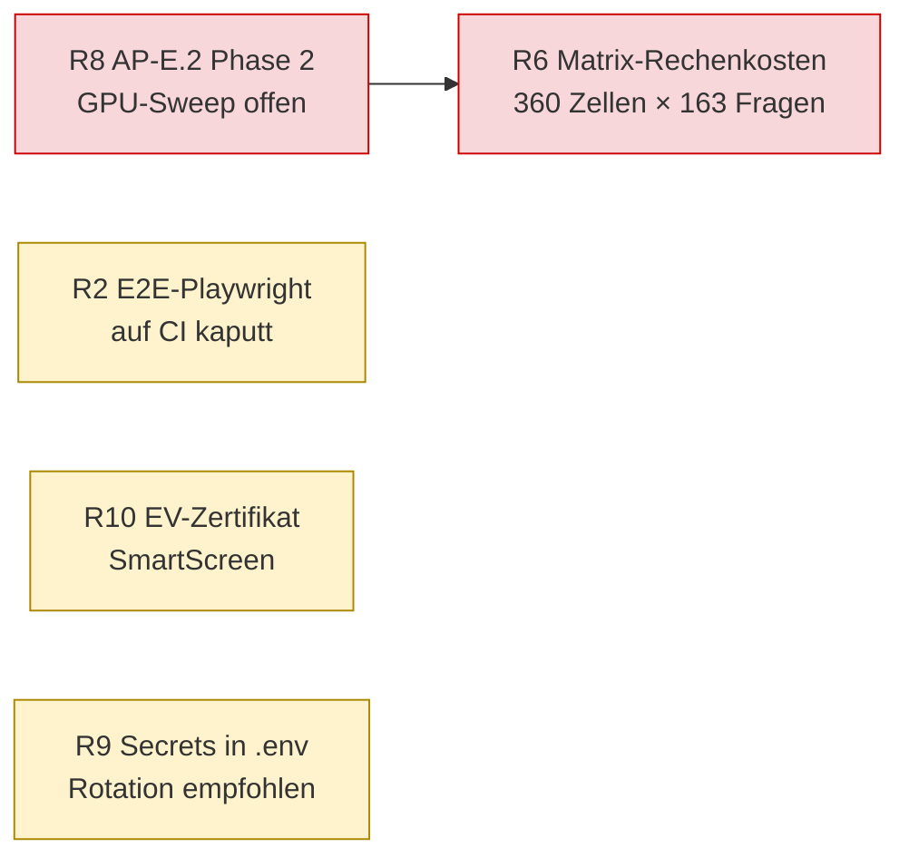

# Risiken, Probleme und Gegenmaßnahmen

Stand: **2026-06-14**. Diese Tabelle konsolidiert die projektrelevanten Risiken aus Projektstatusberichten, Laborberichten, ADRs und den Test-/Eval-Artefakten. Bewertet wird nach aktuellem Status und verbleibendem Rest-Risiko.

Quellen: `docs/work/projektstatusbericht-2026-06-14.md`, `docs/work/projektstatusbericht-2026-06-07.md`, `docs/work/laborberichte/*`, `docs/adr/0001`–`0004`, `tests/evals/answer/matrix-manifest.ts`, `tests/evals/model-license-registry.json`, `.env.example`, `.gitignore`, Memory `e2e-harness-electron-playwright-broken.md` / `loklm-installer-build-rust.md`.

---

## 1. Risikotabelle

| # | Risiko / Problem | Ursache | Auswirkung | Gegenmaßnahme | Status | Rest-Risiko | Quelle |
|---|---|---|---|---|---|---|---|
| R1 | **Partnerseitiger Ausfall (KW 23)** | Projekt-Owner Denis Tudosa (Chunking/Auth/RAG/Installer) zeitweise nicht eingebunden | Integration/Auslieferung stockte, Gesamtstatus *kritisch* | Wiedereinstieg; zwei Releases (v0.4.0/v0.4.1) + AP-6/AP-9-Merges nachgeholt; Status auf *planmäßig* zurückgestuft | **gelöst** | gering — Bus-Faktor bleibt bei 2 Personen | `projektstatusbericht-2026-06-14.md` |
| R2 | **E2E-Playwright startet Electron auf CI nicht** | Playwright-`_electron`-Driver kann die gebaute App im CI-Runner nicht zuverlässig starten | Gesamte `tests/e2e/`-Suite auf CI nicht lauffähig; §8.4-Abnahmetests nur lokal | Abnahme über manuellen Layer (`tests/manual/`) abgedeckt; E2E-Specs bleiben als lokale Vorlage | **offen** | mittel — kein automatisierter UI-Regressionsschutz in CI | `tests/e2e/*`, Memory e2e-harness |
| R3 | **CI baute lange nur die Website** | Erst spät ein vitest-Test-Job (integration + tx) ergänzt | Lange kein automatisierter Test-Gate; Regressionen nur lokal sichtbar | Erster vitest-Job in PR #19 (Electron-Stub für grünen Ubuntu-Lauf) | **teilw. gelöst** | mittel — Job hängt an Merge von PR #19 in `main` | `checks.yml`, `Laborbericht_…2026-06-12.md` |
| R4 | **RetrievalService-E2E modell-gated, skippt in CI** | BGE-M3-GGUF liegt nicht im CI-Runner | Retrieval-Roundtrip in CI ungetestet (lokal grün) | `describe.runIf(GGUF)`; offene Team-Entscheidung über Modell-Download-Step in der Pipeline | **offen** | gering–mittel — lokal verifiziert, CI-Lücke | `ap-t2-abschluss-doku.md` §3 |
| R5 | **Echo-Kammer / Eval-Overfitting** | Dev-Set und Hold-out könnten dieselben Fragen enthalten | Eval-Zahlen überschätzen die echte Qualität | 15 versiegelte Hold-out-Fälle (AP-E1b, separat, von Denis nicht einsehbar) + automatischer Dedup-Guard im Validator | **gemindert** | gering | `ap-e1-abschluss-doku.md` |
| R6 | **Eval-Matrix-Rechenkosten** | Kartesisches Produkt (8 Embedder × 3 Reranker-Optionen × 1 Chunker × 15 LLMs = 360 Zellen, × 163 Fragen × Antwort+Judge) | Hoher GPU-Stunden-Bedarf; Deadline-Risiko für den Abgabe-Laborbericht | Multi-Pod-Sharding (`parseShard`/`selectShard`, round-robin), Pre-Run-Manifest mit GPU-Stunden-Schätzung, retrieval-only-Default (`--no-llm`), `--limit`-Smoke; Scope-Entscheidung offen | **offen** | hoch — Phase 2 vor Abgabe noch nicht gefahren | `matrix-manifest.ts`, `tests/evals/README.md` |
| R7 | **Modelllizenz-Risiko** | Manche starke Modelle (Llama/Gemma/Hermes, jina-reranker-v2) sind nicht OSI-permissiv (Gemma-Terms, CC-BY-NC) | Lizenzverstoß bei kommerzieller Nutzung / Abgabe | Lizenz-Gate: `validate-model-licenses.ts` lässt nur `osi-permissive` + `allowedInDefaultMatrix=true`; `model-license-registry.json` (verifiziert 2026-06-14); non-OSI-Modelle aus den Packs entfernt | **gemindert** | gering | `model-license-registry.json`, `license-validator.test.ts` |
| R8 | **AP-E.2 Phase 2 offen vor Abgabe** | GPU-Sweep noch nicht durchgeführt; Teile der Matrix-Verdrahtung uncommittet | Abgabe-Paper/Laborbericht ohne ausgewertete Matrix-Ergebnisse | LAP-Dataset (2.322 Chunks, 163 DE-Fragen) + Span-Recall-Metrik stehen (Phase 1); Sweep auf RunPod-GPU als nächster Schritt eingeplant | **offen** | hoch | `projektstatusbericht-2026-06-14.md` |
| R9 | **Secrets in lokaler `.env`** | Live-RunPod-/AWS-/S3-Keys liegen lokal | Bei versehentlichem Commit / Repo-Öffnung: Key-Leak | `.env`/`.env.*` gitignored (nur `.env.example` mit Platzhaltern); `test-notes/`, `docs/abgabe/` ebenfalls gitignored | **gemindert** | mittel — Rotation empfohlen, da Live-Keys lokal vorhanden | `.gitignore`, `.env.example` |
| R10 | **EV-Zertifikat / SmartScreen offen** | Kein EV-Code-Signing-Zertifikat | Windows-SmartScreen warnt Endnutzer beim Installer | Code-Signing läuft; EV-Zertifikat ist Budget-/Beschaffungsfrage | **offen** | mittel — UX-Hürde bei Auslieferung | `projektstatusbericht-2026-06-14.md` |
| R11 | **Installer-Build braucht Rust/Tauri** | Tauri-Toolchain nicht auf jedem Rechner installiert | Installer kann nicht überall lokal gebaut werden | Workaround: In-Place-Update via robocopy für lokale Verifikation | **gemindert** | gering–mittel — Build-Reproduzierbarkeit eingeschränkt | Memory `loklm-installer-build-rust.md` |
| R12 | **OCR-Artefakte / Meta-Fragen im LAP-Korpus** | Roh-Extraktion lieferte fehlerhafte Umlaute (440 falsch) + Meta-Fragen | Verfälschte Eval-Grundlage | Korpus auf UTF-8-Neuauszug umgestellt (440 → 8.865 korrekte Umlaute) **vor** Matrix-Läufen; Refusal-Erhalt im Converter | **gelöst** | gering | `projektstatusbericht-2026-06-14.md` Phase 18 |
| R13 | **DEK-Rotation nicht möglich** | Envelope-Design hält DEK über die Installationslebenszeit konstant | Kompromittierter DEK bleibt kompromittiert | Bewusst akzeptiert (Single-User-Lokal-App); Anweisung „neuer Tresor, alten Snapshot importieren" | **akzeptiert** | gering | ADR-0002 |
| R14 | **Vault-Korruption ist fatal** | Single-File-Layout: Header + Body untrennbar | Verlust/Überschreiben von `loklm.vault` = Total-Verlust (auch mit korrekter Passphrase) | Single-File reduziert Drift-Risiko; Backup-Strategie/Export-UI als separate Spec | **teilw. gemindert** | mittel — Backup-UX noch offen | ADR-0002 |
| R15 | **Determinismus-Flakes in Tests** | `searchChunks` ohne Tie-Break; fixes `setTimeout(2000)` in `document-import.test.ts` | Latente Test-Flakes / Cross-Session-Nichtdeterminismus | An Denis (Logik-Domäne) gemeldet: zweiter Sortierschlüssel + Polling-`waitFor` empfohlen | **offen (gemeldet)** | gering | `ap-t2-abschluss-doku.md` §3 |
| R16 | **Auto-Update-Strategie offen** | Velopack vs. electron-updater, Hosting, Rollback ungeklärt | Keine sichere Update-Auslieferung | Als Team-Entscheidung offen markiert | **offen** | mittel | `projektstatusbericht-2026-06-14.md` |

---

## 2. Priorisierung (offene Risiken mit hohem Rest-Risiko)

Die beiden abgabe-kritischen Posten sind **R8** (Phase-2-Sweep) und das daran hängende **R6** (Rechenkosten/Scope). Beide liegen im Verantwortungsbereich von Dominik (Eval-Säule) und hängen an einer Team-Entscheidung zum endgültigen Matrix-Scope (Anzahl Zellen/Modelle/Datensätze) sowie an verfügbarer RunPod-GPU-Zeit.

> WARN Status unklar — R8/R6 sind zum Stichtag offen; ob der vollständige 360-Zellen-Sweep bis zur Abgabe-Deadline gefahren werden kann, hängt von GPU-Budget und Scope-Bestätigung ab. Ein retrieval-only-Lauf (`--no-llm`, deterministisch, schnell) ist als Fallback möglich.

---

## 3. Querverweise

- Test-/CI-Lücken (R2/R3/R4) im Detail: [Testing & QA](19_testing_and_quality_assurance.md) §8–9.
- Krypto-/Secret-/Zertifikat-Risiken (R9/R10/R13/R14): [Sicherheit & Datenschutz](21_security_privacy_and_sensitive_data.md).
- Lizenz-Gate (R7) und Installer-Pivot: [Decision Log](23_decision_log.md).
